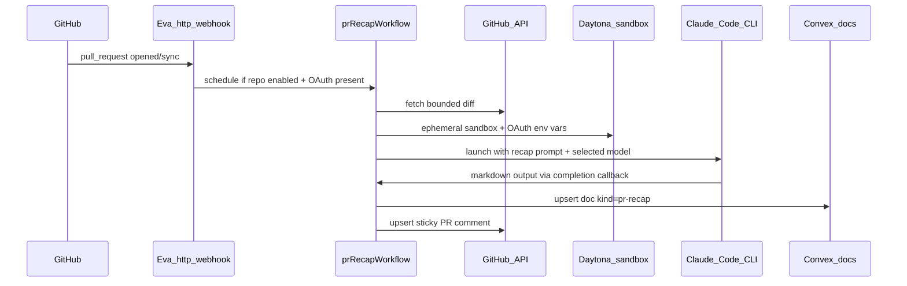

# Eva PR recaps as docs

## Goal

Replace Agent-Native Plans with **first-party Eva storage**: one markdown recap doc per PR, updated on each push, visible in **Docs** with a sidebar filter, plus a **sticky GitHub PR comment** linking to the Eva doc.

**Trigger:** extend existing Eva GitHub webhook — no workflow in carepulse-ts.

**Auth/model (confirmed):** use team `CLAUDE_CODE_OAUTH_TOKEN` (subscription OAuth) + repo-configurable model via the same `ModelSelect` / `useAvailableAiModels` pattern as [`ConfigClient.tsx`](apps/web/src/routes/_repo/$owner/$repo/settings/ConfigClient.tsx). **No `ANTHROPIC_API_KEY`.**



---

## 1. Schema + validators

Extend [`packages/backend/convex/_validators/tableFields.ts`](packages/backend/convex/_validators/tableFields.ts):

| Field           | Purpose                                                                                                     |
| --------------- | ----------------------------------------------------------------------------------------------------------- |
| `kind`          | `v.optional(v.union(v.literal("document"), v.literal("pr-recap")))` — existing rows treated as `"document"` |
| `prUrl`         | GitHub PR html_url (upsert key)                                                                             |
| `prNumber`      | Display + comment text                                                                                      |
| `headSha`       | Last recapped commit                                                                                        |
| `prRecapStatus` | `"pending" \| "ready" \| "error"` while workflow runs                                                       |
| `prRecapError`  | Last failure message                                                                                        |

Add index on [`schema.ts`](packages/backend/convex/schema.ts):

```ts
.index("by_repo_and_pr_url", ["repoId", "prUrl"])
```

Add repo settings on `githubRepoFields`:

```ts
prRecapsEnabled: v.optional(v.boolean()); // default false
prRecapModel: v.optional(aiModelValidator); // fallback: defaultModel → sonnet
```

Apply toggle on the **monorepo parent** repo row (`evalucom/carepulse-ts` root), not sub-apps.

---

## 2. Backend: upsert + queries

Extend [`packages/backend/convex/docs.ts`](packages/backend/convex/docs.ts):

- **`getByPrUrl`** (internalQuery) — `by_repo_and_pr_url` lookup
- **`upsertPrRecapDoc`** (internalMutation) — create or update:
  - Title: `PR #412 — {pr title}` (from webhook payload)
  - On **create:** `docs.create` pattern + `prosemirrorSync.create` with markdown JSON
  - On **update:** reset sync doc like [`createFromSession`](packages/backend/convex/docs.ts) (delete + recreate) — acceptable for system-owned recaps
  - Set `kind: "pr-recap"`, `prUrl`, `prNumber`, `headSha`, `prRecapStatus`
- **`list`** — no change; consumers filter client-side by `kind`

---

## 3. Generation workflow (Claude Code OAuth, not Anthropic API)

New file **`packages/backend/convex/prRecapWorkflow.ts`** — mirror [`summarizeWorkflow.ts`](packages/backend/convex/summarizeWorkflow.ts) / [`docPrdWorkflow.ts`](packages/backend/convex/docPrdWorkflow.ts):

### Step 0 — Gate

Skip when:

- draft PR, bot authors (dependabot/renovate), tiny diffs, missing repo
- `prRecapsEnabled !== true`
- **`CLAUDE_CODE_OAUTH_TOKEN` absent** from merged team+repo env vars (use [`resolveEnvVars`](packages/backend/convex/envVarResolver.ts) — same check as [`getAIProviderAvailability`](packages/backend/convex/_validators/aiModels.ts) for `claude`)
- Selected model's provider token missing (e.g. if user picks codex without `OPENAI_API_KEY`)

On gate failure: patch doc `prRecapStatus: "error"` with actionable message (e.g. "Add CLAUDE_CODE_OAUTH_TOKEN to team env vars").

### Step 1 — Fetch diff

New helper in [`packages/backend/convex/_github/api.ts`](packages/backend/convex/_github/api.ts): `pulls.get` + compare/files, cap size (~500KB / N files).

### Step 2 — Sandbox + Claude Code

Follow [`automationWorkflow.ts`](packages/backend/convex/automationWorkflow.ts) ephemeral pattern:

```ts
prepareSandboxSteps(step, {
  installationId,
  repoOwner, repoName, repoId,
  ephemeral: true,
  streamingEntityId: `pr-recap:${docId}`,
  baseBranch: defaultBaseBranch,
});

launchOnExistingSandbox({
  sandboxId,
  entityId: docId,
  prompt: buildPrRecapPrompt({ pr metadata, diff }),
  userId: repo.connectedBy,          // webhook has no human actor; repo connector owns subscription
  model: repo.prRecapModel ?? repo.defaultModel ?? "sonnet",
  allowedTools: "",                    // text-only output; diff already in prompt
  completionMutation: "prRecapWorkflow:handleCompletion",
  repoId,
});
```

OAuth token flows automatically: `prepareSandboxSteps` → sandbox env via existing [`resolveEnvVars`](packages/backend/convex/envVarResolver.ts) path (same as sessions/tasks).

### Step 3 — Save + comment

- **`handleCompletion`**: parse agent markdown output → `upsertPrRecapDoc` with `prRecapStatus: "ready"`
- **GitHub comment** — new `_github/prComments.ts` helper:
  - Marker comment body (hidden HTML comment id) for upsert
  - Link: `{EVA_WEB_URL}/{owner}/{repo}/docs/{docId}/content`
  - Marker-only upsert for v1 (no stored comment id)

On failure: patch doc `prRecapStatus: "error"` + `prRecapError`; comment gets skip/failure line.

**Prompt output:** structured markdown (Summary, Schema/API changes, Before/After, Risks, Files touched) — no Agent-Native block format.

---

## 4. Webhook integration

Extend [`packages/backend/convex/http.ts`](packages/backend/convex/http.ts) `pull_request` handler (after existing session/project sync):

On `opened | synchronize | reopened | ready_for_review`:

1. Parse `repository.full_name`, `pull_request.html_url`, `number`, `head.sha`, `title`, `draft`, author
2. Resolve `githubRepos` via [`_githubRepos/queries.ts`](packages/backend/convex/_githubRepos/queries.ts) `by_owner_and_name` — pick **parent codebase row**
3. If `prRecapsEnabled !== true` → no-op
4. Upsert pending doc immediately (so UI shows in-progress state)
5. `workflow.start(internal.prRecapWorkflow.prRecapWorkflow, { repoId, docId, prUrl, ... })`

Do **not** run on `closed` unless merged (out of scope v1).

---

## 5. Web UI (docs route only)

### Sidebar filter — [`DocsSidebar.tsx`](apps/web/src/lib/components/sidebar/DocsSidebar.tsx)

- Add nuqs parser in [`search-params.ts`](apps/web/src/lib/search-params.ts): `docListFilter: "all" | "documents" | "pr-recaps"` (default `"all"`)
- Segmented control: **All / Documents / PR recaps**
- Row badge for `kind === "pr-recap"`: `PR #N` chip + git-merge icon
- Hide **New document** / **Upload PRD** when filter is `pr-recaps` only

### Doc viewer — [`DocViewer.tsx`](apps/web/src/lib/components/docs/DocViewer.tsx)

When `doc.kind === "pr-recap"`:

- Banner: link to GitHub PR + short SHA + "Auto-generated recap"
- Default tab → **content**
- Hide PRD-only actions: Interview, Re-extract, Generate tests; relabel copy → "Copy recap"
- Start in **viewing** mode; keep comments/history/presence

Same route: `/{owner}/{repo}/docs/{id}/{tab}`.

---

## 6. Repo settings

Add **PR recaps** section (parent codebase settings, near docs or in [`ConfigClient.tsx`](apps/web/src/routes/_repo/$owner/$repo/settings/ConfigClient.tsx)):

- Toggle: `prRecapsEnabled`
- **`ModelSelect`** bound to `prRecapModel` via `useAvailableAiModels` — same UX as Default Model / Audit Review Model
- Help text: uses team Claude Code subscription (`CLAUDE_CODE_OAUTH_TOKEN`); link to env vars setup if unavailable
- Disable toggle/model save when Claude provider unavailable (mirror SetupBanner messaging)

Enable manually for `evalucom/carepulse-ts` after deploy.

---

## 7. carepulse-ts cleanup (separate repo)

In `C:/Vedant/Evalucom/Github/carepulse-ts` (when shipping):

- **Delete** uncommitted Agent-Native files: `pr-visual-recap.yml`, `pr-visual-recap-setup.md`
- **Already deleted:** `rebuild-snapshot.yml`
- **No replacement workflow** — Eva webhook handles triggering

---

## 8. Env / secrets (Eva)

| Var                       | Purpose                                                                   |
| ------------------------- | ------------------------------------------------------------------------- |
| `CLAUDE_CODE_OAUTH_TOKEN` | Team env var — Claude Code subscription auth (already used platform-wide) |
| `GITHUB_WEBHOOK_SECRET`   | Already exists                                                            |
| GitHub App credentials    | Already exists — diff fetch + PR comments                                 |
| `DAYTONA_API_KEY`         | Already in team/repo env — sandbox for agent run                          |

**Not used:** `ANTHROPIC_API_KEY`, `PLAN_RECAP_TOKEN`.

Optional: `EVA_WEB_URL` for comment links if not already derivable.

---

## 9. Verification

- Team has `CLAUDE_CODE_OAUTH_TOKEN` configured
- Enable `prRecapsEnabled` + pick model on carepulse-ts parent repo
- Open/sync test PR → webhook fires → doc appears under **PR recaps** filter
- Re-push → same doc updates (same `prUrl`), new `headSha`
- Sticky GitHub comment updates with Eva doc link
- Draft PR → skipped
- Missing OAuth → error status on doc, no silent failure
- Repo with toggle off → no doc, no comment

---

## Out of scope (v1)

- Agent-Native-style diagrams/wireframes (markdown only)
- Per-push version history
- Fork PR recaps without Eva app secrets
- HTTP ingest API for non-webhook repos
