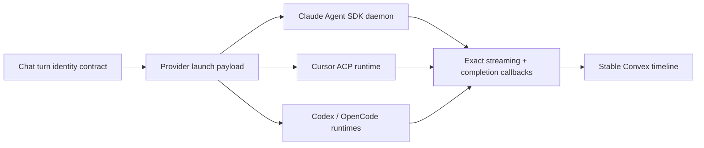
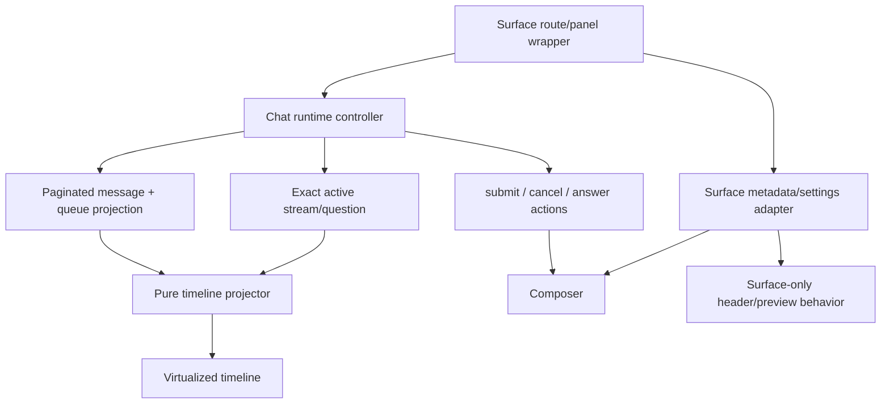

# Plan: Harden Eva chat turn identity and frontend architecture

Status: recommended, not implemented
Research date: 2026-07-31
t3code revision reviewed: [`fccec9f097ab6b89714161ccab2efc7e19d59c00`](https://github.com/pingdotgg/t3code/tree/fccec9f097ab6b89714161ccab2efc7e19d59c00)
Related provider plan: [`cursor-acp-adoption.md`](./cursor-acp-adoption.md)

## Executive decision

Eva should adopt the useful architectural ideas visible in t3code's frontend and command model, but it should express them in Eva's existing Convex-native architecture.

The highest-priority work is not visual polish. It is to make a chat turn a first-class, durable identity across submission, queueing, execution, streaming, questions, completion, cancellation, and rendering.

The implementation should:

1. Replace every client-side `isExecuting ? enqueue : add + start` branch with one server-owned `submitTurn` mutation that atomically decides whether the turn starts or queues.
2. Give each submitted turn one client-generated `turnId` that survives optimistic rendering, queueing, dequeue, retries, execution, and completion.
3. Bind streaming updates, pending questions, completion callbacks, cancellation, and workflow recovery to the exact `turnId`, assistant message ID, and execution attempt.
4. Stop updating or rendering the "latest" assistant message. Every update must target a specific assistant message.
5. Derive the visible timeline once in a pure, single-pass projection with stable row identities, then virtualize and paginate it.
6. Consolidate duplicated task/project/session controller logic without copying t3code's Effect, Atom, WebSocket, or event-sourcing stack.
7. Retain only expensive imperative resources between session switches, not three complete hidden chat trees with live subscriptions and effects.
8. Later, consume provider-described composer controls through plain TypeScript and Convex validators, coordinated with the ACP/provider plans.

The first three items are one correctness project. They directly address the class of failures where a new Working bubble temporarily renders a previous reply, a delayed callback updates the wrong row, or a queued turn is started from stale client state.

The later items are performance, maintainability, and UX work. They must not delay the correctness phases.

## Why this plan exists

Eva has already fixed two concrete stale-reply paths:

- a warm Claude daemon performed its final stream reconciliation after completion, allowing the completed reply to reappear in the next turn's streaming row;
- a delayed branch-publish failure reused a generic finalizer and temporarily replaced the next turn with the previous answer.

Those fixes were necessary, but they guarded individual timing paths. The frontend and backend still share a weaker architectural assumption: the current turn can often be inferred from the newest unfinished assistant row, the latest streaming row for an entity, or the client's most recent `isExecuting` snapshot.

That assumption makes unrelated races look like the same user-visible bug:

- an old callback writes after a newer turn starts;
- a completion path updates the latest message instead of its own message;
- the client decides to start while the server has already become busy;
- one of two independent mutations succeeds and the other fails;
- an optimistic row is replaced with a new canonical identity;
- a stream with no message identity is attached to whichever assistant row currently looks active.

The durable fix is to remove the inference. The server must know the exact turn and assistant row, and the UI must render only that relationship.

## Relationship to the Cursor ACP plan

This plan and the Cursor ACP plan solve different layers of the same product.

- The ACP plan changes how Eva controls Cursor and how Cursor reports typed runtime events and completion.
- This plan changes how Eva accepts a chat turn, owns its durable lifecycle, projects it into the UI, and prevents any provider callback from touching another turn.

The dependency direction is:



The chat turn identity phases should be implemented before or alongside Cursor ACP's first production rollout. ACP gives Cursor a better protocol, but it does not by itself prevent Eva from attaching a valid Cursor event to the wrong message row.

The provider-descriptor phase in this plan should wait for the ACP capability-discovery work. It must consume the normalized capability contract produced there rather than inventing a second provider metadata system.

## Scope

This plan covers the primary chat surfaces:

- repository sessions;
- task sandbox chat;
- project sandbox chat;
- shared message timeline and composer components;
- queued turns;
- streaming activity;
- blocking questions;
- provider callbacks and completion finalizers;
- session route retention;
- message history loading and media resolution;
- the legacy project interview renderer where it overlaps the shared chat model.

It includes backend work because the frontend cannot make turn ownership correct by itself.

## Non-goals

This plan does not:

- adopt t3code's Effect runtime;
- adopt Effect Schema, Effect Atom, or Effect equality;
- introduce a local WebSocket server;
- introduce a SQLite event store;
- port t3code's replay/recovery stack;
- replace Convex as Eva's durable source of truth;
- merge every provider into one universal runtime abstraction;
- replace the existing rich Eva composer with t3code's composer;
- rewrite Diffs, Files, reviews, media capture, design variations, or the preview system;
- create a new `chatTurns` table in the first implementation;
- split files merely to meet a line-count target;
- add virtualization before stable row identity and scroll contracts exist.

## Research scope

### Eva sources reviewed

The plan is based on the current implementation in:

- `apps/web/src/routes/_repo/$owner/$repo/sessions/_components/useSessionSend.ts`
- `apps/web/src/routes/_repo/$owner/$repo/sessions/SessionDetailClient.tsx`
- `apps/web/src/routes/_repo/$owner/$repo/sessions/ChatPanel.tsx`
- `apps/web/src/routes/_repo/$owner/$repo/sessions/route.tsx`
- `apps/web/src/lib/components/chat/ChatBody.tsx`
- `apps/web/src/lib/components/chat/chatBodyUtils.ts`
- `apps/web/src/lib/components/chat/ChatComposer.tsx`
- `apps/web/src/lib/components/tasks/TaskSandboxChatPanel.tsx`
- `apps/web/src/lib/components/projects/ProjectSandboxChatPanel.tsx`
- `apps/web/src/lib/components/projects/ProjectChatTab.tsx`
- `apps/web/src/lib/components/projects/ProjectChatMessageList.tsx`
- `packages/backend/convex/_validators/tableFields.ts`
- `packages/backend/convex/schema.ts`
- `packages/backend/convex/messages.ts`
- `packages/backend/convex/queuedMessages.ts`
- `packages/backend/convex/streaming.ts`
- `packages/backend/convex/_sessions/execution.ts`
- `packages/backend/convex/_sessions/mutations.ts`
- `packages/backend/convex/_sessions/workflow.ts`
- `packages/backend/convex/agentTaskChatWorkflow.ts`
- `packages/backend/convex/projectChatWorkflow.ts`
- `packages/backend/convex/_chat/surfaceAdapters.ts`
- `packages/backend/convex/_queues/helpers.ts`
- callback launch, streaming, question, completion, and daemon files under `packages/backend/callback-src`

### t3code sources reviewed

All t3code conclusions are pinned to commit `fccec9f097ab6b89714161ccab2efc7e19d59c00`.

- [`ThreadTurnStartCommand`](https://github.com/pingdotgg/t3code/blob/fccec9f097ab6b89714161ccab2efc7e19d59c00/packages/contracts/src/orchestration.ts#L669-L700) carries a command ID, thread ID, client message ID, attachments, model selection, runtime mode, interaction mode, and creation time as one command.
- [`ChatView` turn submission](https://github.com/pingdotgg/t3code/blob/fccec9f097ab6b89714161ccab2efc7e19d59c00/apps/web/src/components/chat/ChatView.tsx#L4694-L4746) creates the user message identity before dispatch.
- [`MessagesTimeline.logic.ts`](https://github.com/pingdotgg/t3code/blob/fccec9f097ab6b89714161ccab2efc7e19d59c00/apps/web/src/components/chat/MessagesTimeline.logic.ts#L577-L639) reuses unchanged timeline row objects by stable row ID.
- [`threadReducer.ts`](https://github.com/pingdotgg/t3code/blob/fccec9f097ab6b89714161ccab2efc7e19d59c00/packages/client-runtime/src/state/threadReducer.ts#L231-L326) applies typed events to a client projection instead of asking components to reconstruct lifecycle from unrelated fields.
- [`threadDetail.ts`](https://github.com/pingdotgg/t3code/blob/fccec9f097ab6b89714161ccab2efc7e19d59c00/packages/client-runtime/src/state/threadDetail.ts#L68-L188) centralizes the thread detail projection.
- [`model.ts`](https://github.com/pingdotgg/t3code/blob/fccec9f097ab6b89714161ccab2efc7e19d59c00/packages/contracts/src/model.ts#L7-L53) defines typed provider/model selection data.
- [`composerProviderState.tsx`](https://github.com/pingdotgg/t3code/blob/fccec9f097ab6b89714161ccab2efc7e19d59c00/apps/web/src/components/chat/composerProviderState.tsx#L55-L80) derives composer state from provider capabilities.
- [`ComposerPendingUserInputPanel.tsx`](https://github.com/pingdotgg/t3code/blob/fccec9f097ab6b89714161ccab2efc7e19d59c00/apps/web/src/components/chat/ComposerPendingUserInputPanel.tsx#L60-L147) includes keyboard shortcuts and an explicit request lifecycle.
- [`overview.md`](https://github.com/pingdotgg/t3code/blob/fccec9f097ab6b89714161ccab2efc7e19d59c00/docs/internals/overview.md#L51-L59) confirms that t3code's shared client runtime owns transport, retry, RPC, cached state, and projections, while React components consume it.

### Official implementation references

- [Convex scheduled functions](https://docs.convex.dev/scheduling/scheduled-functions) confirms that scheduling from a mutation is atomic with the mutation: either the database changes and scheduled job both commit, or neither does.
- [Convex optimistic updates](https://docs.convex.dev/client/react/optimistic-updates) documents that optimistic query changes are temporary, rerun against changing local query state, and roll back when the mutation completes.
- [Convex paginated queries](https://docs.convex.dev/database/pagination) provides reactive cursor pagination through `paginate` and `usePaginatedQuery`.
- [React Virtuoso's API](https://virtuoso.dev/react-virtuoso/api-reference/virtuoso/) documents stable `computeItemKey`, inverse scrolling through `firstItemIndex`, bottom-follow behavior, and viewport state for the already-installed `react-virtuoso` package.
- [React Virtuoso's overview](https://virtuoso.dev/react-virtuoso/) documents variable-height measurement, dynamic size changes, and prepend support.

## What t3code does better

The useful t3code ideas are architectural, not package choices.

### One typed turn-start command

t3code does not ask the UI to persist a message and then separately start a runtime. A turn start is one typed command with stable client identity and a complete settings snapshot.

Eva should adopt that property through one Convex mutation. Eva does not need t3code's RPC command bus to get it.

### Stable logical identities before server acknowledgement

t3code creates a message identity before dispatch. That identity remains meaningful across optimistic state and server events.

Eva currently generates fake branded Convex IDs for optimistic rows, but the existing `message.clientId` field is not passed by the session send path. The optimistic row therefore remounts when the canonical query arrives.

Eva should create a `turnId` before submission and derive stable logical row keys from it. Canonical Convex IDs remain database identities, not optimistic placeholders.

### A separate timeline projection

t3code converts raw state into timeline rows in a dedicated logic module and reuses unchanged row objects. Its React timeline consumes the projection.

Eva currently performs history building, preceding-user lookup, jump-tick generation, stream attachment, and pending-question fallback inside or immediately around `ChatBody`. Several helpers scan backward repeatedly.

Eva should move pure projection work out of the renderer and compute it in one pass.

### Provider-described composer state

t3code has explicit model-selection and provider option descriptors. The composer renders what the selected provider supports.

Eva currently has a hard-coded model union and fixed composer controls. Eva should later normalize provider capabilities into plain discriminated TypeScript values and Convex validators.

### Explicit request identity for blocking input

t3code's pending-input UI acts on an explicit request. Eva already has structured question payloads and `toolUseId`, which is a good foundation, but the question is still discovered through several fallbacks.

Eva should bind the question to the exact turn and assistant message and remove fallback ownership.

## What Eva already does better and must retain

Eva should not mistake t3code's larger architecture for a general upgrade.

Eva already has:

- Convex as a durable, reactive, collaborative source of truth;
- server-owned queues and workflow orchestration;
- live model/mode/trait settings without mirrored React state;
- a shared primary `ChatBody` across session, task, and project sandbox chat;
- richer attachments, captured screenshots/videos, design variations, review comments, teammate identity, typing state, and walkthrough requirements;
- URL-driven navigation;
- smaller and more navigable modules than t3code's multi-thousand-line chat files;
- a strong backend surface-adapter seam for watchdog, queue, and recovery behavior;
- a structured pending-question parser boundary;
- an existing `react-virtuoso` dependency.

The plan preserves those advantages.

## What must not be copied from t3code

### Effect and Effect Atom

t3code uses Effect across schemas, services, runtime state, equality, and atoms. Eva should use ordinary TypeScript discriminated unions, Convex validators, generated Convex types, and small pure functions.

No Effect package should be added.

### Local WebSocket replay and client recovery

t3code needs a reconnecting client runtime because it connects to a local server and reconstructs state from an event log. Eva already gets durable reactive synchronization from Convex.

Adding another replay layer would create two sources of truth and new ordering bugs.

### Full event sourcing

The turn identity described here is not an event store. Messages, queue rows, entity state, and workflow state remain Eva's persisted model.

### Giant frontend modules

The useful projection and controller concepts must be implemented as focused modules. They must not produce another 2,000-6,000-line chat component.

### Timestamp-only interleaving

Eva should not merge stream, question, work, and message rows by guessing from timestamps. Relationships must use `turnId`, canonical document IDs, and explicit row kinds.

## Current Eva architecture

### Immediate session send

The session UI currently:

1. calculates `isExecuting` from the message list;
2. calls `sessions.addMessage` and `sessionWorkflow.startExecute` concurrently with `Promise.all`;
3. optimistically inserts a user row and assistant placeholder using invented Convex-branded IDs;
4. catches either mutation's failure and inserts an assistant error message;
5. clears pending review comments in `finally`.

The two mutations are independent transactions.

Possible outcomes include:

| Message mutation                       | Start mutation   | Result                                                 |
| -------------------------------------- | ---------------- | ------------------------------------------------------ |
| succeeds                               | succeeds         | expected path                                          |
| succeeds                               | fails            | durable user message with no owned turn                |
| fails                                  | succeeds         | execution with no matching durable user row            |
| succeeds slowly                        | succeeds quickly | assistant placeholder can precede the user row         |
| either rejects after the other commits | other commits    | catch inserts an error even though work may be running |

This is a correctness boundary, not merely an optimistic-UI issue.

### Task and project send

Task and project chat call `addMessage` and then `startExecute` sequentially. That avoids the session's concurrent ordering case, but it still has a partial-commit seam: message insertion can succeed before execution start fails.

All three surfaces decide start versus queue from client state. Another client, a completion, or a dequeue can change server state between that read and the mutation.

### Queue lifecycle

Queued messages carry content, settings, account, traits, attachments, user, and order. They do not carry an identity that remains the same after dequeue.

When a queued row becomes an active user/assistant pair, the UI and backend infer continuity from chronology and entity state rather than a shared turn key.

### Streaming lifecycle

`streamingActivity` is keyed only by `entityId`. It contains current activity, current content, an optional pending-question string, and a timestamp.

The row does not identify:

- which turn produced it;
- which assistant message should display it;
- which provider attempt produced it;
- whether it is still valid after cancellation or restart.

`ChatBody` therefore finds an unfinished assistant row and attaches the entity stream to that row, falling back to the last message in some states.

### Completion lifecycle

Several internal paths update the most recent message for a parent. `messages.updateLastInternal` is the clearest example. The session workflow also searches recent messages for the last relevant assistant placeholder and cleans up inferred orphans.

These helpers are vulnerable whenever system alerts, delayed callbacks, synthetic turns, or a newer turn alter the newest-row ordering.

### Query and render lifecycle

The session screen separately subscribes to session state, all messages with resolved media, queue state, primary streaming, summary streaming, startup streaming, pending question, authentication data, and duplicated session/model queries in child components.

`ChatBody` then builds derived history and jump metadata and repeatedly scans backward from assistant messages. Every message is mounted.

### Session route retention

The sessions route keeps up to three complete `CachedSessionShell` trees mounted and hides inactive shells. Hidden shells retain their queries, effects, composer, and chat tree. Some behavior checks `isRouteActive`, but subscription and render ownership remains broad.

## Root-cause map

| Symptom                                          | Immediate mechanism                                                          | Architectural cause                                   | Correct fix phase |
| ------------------------------------------------ | ---------------------------------------------------------------------------- | ----------------------------------------------------- | ----------------- |
| New bubble shows old reply                       | stale stream row attached to newest unfinished assistant                     | stream has no turn/message identity                   | Phases 1-3        |
| Queued reply initially belongs to another prompt | dequeue and callback ownership inferred from latest rows                     | queue loses identity on activation                    | Phases 1-3        |
| User message exists but no run starts            | first mutation commits, second fails                                         | send is two transactions                              | Phase 2           |
| Run starts without matching user row             | start commits while message insertion fails                                  | send is two transactions                              | Phase 2           |
| Duplicate message after retry                    | no durable submission idempotency key                                        | client-generated identity is not persisted end to end | Phases 1-2        |
| Optimistic row flickers/remounts                 | temporary fake `_id` is replaced                                             | database ID is misused as logical UI identity         | Phase 4           |
| Old callback overwrites new turn                 | callback targets entity/latest row                                           | no attempt-scoped ownership check                     | Phase 3           |
| Pending question appears on wrong bubble         | newest-row fallback                                                          | question lacks exact turn/message ownership           | Phase 3           |
| Long chat becomes expensive                      | full collect, per-message media resolution, repeated scans, all rows mounted | no paginated stable projection                        | Phases 5-6        |
| Hidden sessions keep doing work                  | whole route trees retained                                                   | cache boundary is at UI tree level                    | Phase 7           |
| Task/project/session behavior drifts             | near-copy controllers and entry points                                       | shared lifecycle lacks one public contract            | Phases 2 and 4    |

## Target architecture

```mermaid
sequenceDiagram
  participant UI as Composer
  participant C as Convex submitTurn mutation
  participant Q as Queue/messages/entity transaction
  participant D as Scheduled dispatch
  participant P as Provider runtime
  participant S as Exact stream endpoint
  participant T as Timeline projection

  UI->>UI: create turnId once
  UI->>C: submitTurn(surface, turnId, content, settings)
  C->>Q: authorize + idempotency check
  alt entity already has activeTurn
    Q->>Q: insert queued row with same turnId
    C-->>UI: accepted: queued
  else entity idle
    Q->>Q: insert user + assistant rows with same turnId
    Q->>Q: set activeTurn(turnId, assistantMessageId, attempt)
    Q->>D: schedule dispatch atomically
    C-->>UI: accepted: active + canonical ids
  end
  D->>P: launch with turnId + assistantMessageId + attempt
  P->>S: stream/update exact identity tuple
  S->>S: reject unless tuple matches activeTurn
  S-->>T: reactive exact stream row
  T->>T: attach stream only to matching assistant row
  P->>S: complete exact identity tuple
  S->>Q: finalize exact assistant id; clear matching activeTurn
  Q->>D: activate next queued turn atomically
```

### Core design choice: one `turnId`, not a forest of client IDs

The client creates one UUID immediately before submission. That `turnId` is:

- the mutation idempotency key;
- the durable link between the user and assistant messages;
- the identity retained while queued;
- the identity placed in `pendingTurn`;
- the identity sent to the sandbox callback/provider runtime;
- the identity carried by stream updates and pending questions;
- the base for optimistic row keys.

Logical UI row IDs are derived without pretending they are Convex IDs:

- `turn:<turnId>:user`
- `turn:<turnId>:assistant`
- `turn:<turnId>:working`
- `turn:<turnId>:question:<toolUseId>`

Canonical `_id` values remain `Id<"messages">` values assigned by Convex.

Eva does not need both t3code's command ID and message ID for the first version. Convex mutation submission and one user message have the same idempotency boundary. If a future command can contain multiple user messages, that decision can be revisited.

### Core design choice: no `chatTurns` table initially

A separate lifecycle table would duplicate state already held by:

- the queued message document before activation;
- the user and assistant message documents after activation;
- the entity's `activeTurn` while executing;
- the workflow component for durable execution.

The first implementation should add explicit identity to those records instead of creating a second state machine that must be synchronized with all of them.

Add a `chatTurns` table only if production observability later proves that attempt history or cross-state reporting cannot be expressed without it.

## Domain vocabulary

| Term                 | Meaning                                                                                     | Owner                                     |
| -------------------- | ------------------------------------------------------------------------------------------- | ----------------------------------------- |
| `turnId`             | Client-generated UUID for one submitted user turn, preserved through queue and execution    | client creates; Convex validates/persists |
| canonical message ID | Convex `Id<"messages">` for one stored user or assistant row                                | Convex                                    |
| logical row ID       | Stable UI key derived from `turnId` and row kind; historical rows fall back to canonical ID | timeline projection                       |
| `attempt`            | Monotonic integer for provider execution attempts of the same turn                          | Convex dispatch logic                     |
| `activeTurn`         | Minimal entity-level identity tuple for the only turn allowed to stream or complete         | session/task/project document             |
| queued turn          | A `queuedMessages` row with a preserved `turnId` and settings snapshot                      | Convex queue                              |
| pending turn         | Provider-ready prompt staged for daemon claim, carrying the active identity tuple           | entity `pendingTurn`                      |
| exact stream         | A `streamingActivity` row that includes the active identity tuple                           | Convex streaming table                    |
| exact question       | A `pendingQuestions` row bound to turn, assistant message, attempt, and tool-use request    | Convex question table                     |
| legacy row           | Historical message written before turn identity existed                                     | read compatibility only                   |

## Non-negotiable invariants

These invariants should be written as code comments next to the shared lifecycle core and as contract tests.

1. One client submission calls one public mutation.
2. The server, not the client, decides whether a submitted turn starts or queues.
3. Retrying `submitTurn` with the same parent and `turnId` never creates a second queue row, message pair, workflow, or provider process.
4. Reusing a `turnId` with different immutable content or settings fails loudly.
5. An active turn always has an exact assistant message ID before provider dispatch is scheduled.
6. A queue row keeps the same `turnId` when it becomes active.
7. A stream update can render only on the assistant row whose `turnId` and canonical assistant message ID match the stream row.
8. A callback can mutate a turn only when `(turnId, assistantMessageId, attempt)` matches the entity's current `activeTurn`.
9. A stale callback is logged and ignored. It never falls back to the current/latest row.
10. Completion, failure, cancellation, timeout, and publish errors update explicit document IDs.
11. Clearing streaming or pending questions is conditional on the expected identity tuple.
12. Starting a new turn cannot clear or overwrite a previous turn after the new turn has claimed ownership.
13. The UI never fabricates an `Id<"messages">`.
14. Optimistic and canonical rows share one logical row ID, so React does not remount them.
15. Pending review comments and attachments are cleared only after `submitTurn` is accepted.
16. An accepted active turn and its scheduled dispatch commit atomically.
17. An entity's `activeTurn` is the authoritative busy signal; scanning unfinished messages is compatibility behavior only.
18. Provider output is never selected by "last assistant message" after turn identity is enabled.
19. Historical messages without `turnId` remain readable but can never own a live stream.
20. Task, project, and session surfaces pass the same lifecycle contract tests.

## Proposed data contract

### `messages`

Add to the exported `messageFields` object in `_validators/tableFields.ts`:

- `turnId: v.optional(v.string())`
- `turnRequestFingerprint: v.optional(v.string())`

Rules:

- every new user message created by `submitTurn` has `turnId`;
- its assistant placeholder has the same `turnId`;
- synthetic continuations receive a server-generated `turnId`;
- system alerts that do not represent a turn may omit it;
- historical rows may omit it permanently;
- the user row stores a server-computed fingerprint of the normalized immutable submission so an idempotent retry can reject accidental `turnId` reuse with different input;
- the existing `clientId` remains during compatibility, is populated with `turnId` for one release if needed, and is removed only after all readers stop using it.

Add indexes:

- `messages.by_parent_and_turn` on `[parentId, turnId]` for idempotency and exact lookup;
- keep `messages.by_parent` for chronological reads until pagination migration is complete.

The index returns at most the user and assistant rows for a normal turn. Code must validate roles rather than assuming array position.

### `queuedMessages`

Add to `queuedMessageFields`:

- `turnId: v.optional(v.string())` during the widen phase;
- `turnRequestFingerprint: v.optional(v.string())` during the widen phase;
- make it required for all new writes immediately after deployment;
- preserve it through edit and reorder;
- use it when activating the queue row.

Add index:

- `queuedMessages.by_parent_and_turn` on `[parentId, turnId]`.

Existing queued rows should be backfilled with generated UUIDs before identity enforcement. They must not be paired by timestamp with historical messages.

### Surface entity documents

Add one shared exported validator for `activeTurn` and reuse it in session, task, and project field definitions:

```text
activeTurn?: {
  turnId: string
  assistantMessageId: Id<"messages">
  attempt: number
  acceptedAt: number
}
```

This is intentionally small. Existing surface-specific fields remain responsible for workflow IDs, sandbox IDs, cancellation timestamps, model settings, and provider-specific pending state.

Rules:

- `activeTurn` is written in the same mutation that inserts the user/assistant pair;
- its existence is the server's busy/queue decision;
- it is cleared only by a finalizer that presents the matching tuple;
- a dispatch failure finalizes the exact assistant row before clearing it;
- queue activation installs the next `activeTurn` in the same transaction that deletes its queue row and inserts its message pair.

### `pendingTurn`

Extend each daemon-pull `pendingTurn` validator with:

- `turnId`;
- `assistantMessageId`;
- `attempt`.

The claim operation returns the tuple with the prompt. The daemon echoes it on every stream, question, heartbeat, and completion request.

### `streamingActivity`

Move the streaming field definition into the validator source-of-truth module and add:

- `turnId: v.optional(v.string())` during migration;
- `assistantMessageId: v.optional(v.id("messages"))` during migration;
- `attempt: v.optional(v.number())` during migration.

For identity-enabled active turns, all three fields are required by mutation logic even while schema validators remain temporarily optional for old sandbox bundles.

`entityId` remains useful for the subscription and unique row lookup. It is no longer sufficient authorization to update the row.

### `pendingQuestions`

Add:

- `turnId`;
- `assistantMessageId`;
- `attempt`.

The existing Convex document ID is the question ID. `toolUseId` remains the provider request identity. `pendingQuestions` becomes the only source of truth for live blocking input; the duplicated `streamingActivity.pendingQuestion` field remains read-compatible during rollout and is then removed.

Answer and claim mutations must include the question ID and expected turn tuple. A late answer to a completed question must return a typed stale result rather than waking another turn.

### Callback/launch contract

Every provider launch receives:

- surface kind and parent ID;
- `turnId`;
- canonical assistant message ID;
- `attempt`;
- callback protocol version.

Every callback request sends the same fields. HMAC signing continues to protect callback authenticity; identity matching protects turn ownership.

## Public API contract

### One submission mutation

Expose one public Convex mutation under a chat-lifecycle namespace, for example `api.chatTurns.submit`.

Its validator should be a discriminated union with shared fields spread from one exported validator object:

- session variant: session ID, mode, model, traits, provider account, attachments, optional design settings;
- task variant: task ID, model, traits, provider account, attachments;
- project variant: project ID, model, traits, provider account, attachments.

Shared fields:

- `turnId`;
- content;
- optional display content;
- attachment storage IDs;
- immutable settings snapshot needed by queue/dequeue and display.

The return value should be a discriminated union:

```text
{ kind: "active", turnId, userMessageId, assistantMessageId }
{ kind: "queued", turnId, queuedMessageId }
{ kind: "existing", turnId, location: "active" | "queued" | "completed" }
```

The public mutation should be thin. A shared internal core receives a concrete surface adapter after the discriminant is narrowed.

### Why one API is safe here

This unifies a real domain operation with identical correctness semantics. It does not force provider launch, prompt construction, mode handling, or sandbox behavior into one generic implementation.

The surface adapter remains responsible for:

- loading and authorizing its entity;
- reading/writing its active identity field;
- resolving sticky provider account rules;
- snapshotting surface-specific settings;
- creating a dispatch payload;
- scheduling its existing workflow entry point;
- producing its streaming entity ID.

### Idempotency behavior

`submitTurn` checks, in order:

1. existing queued row by parent and `turnId`;
2. existing message rows by parent and `turnId`;
3. current `activeTurn` equality;
4. only then creates state.

If a matching turn exists with identical immutable input, return `kind: "existing"`.

If a matching turn exists with different content, attachments, model, mode, account, or traits, throw a stable validation error. Silent payload replacement would make retries nondeterministic.

The backend computes `turnRequestFingerprint` from a canonical serialization of the normalized immutable input. The client must not supply or control this fingerprint. Phase 0 should confirm the smallest existing hashing utility/runtime API that works in Convex; do not add a dependency only for this value.

### Server-owned start-or-queue decision

Within the transaction:

- if `activeTurn` exists, insert a queue row;
- during compatibility, also treat a legacy active workflow/pending turn as busy even when `activeTurn` is absent;
- otherwise create and activate the turn;
- never rely on a client `isExecuting` argument;
- never query only the last assistant row to determine activity.

The client may still use local execution state to choose its optimistic visual, but that prediction has no authority.

### Atomic dispatch scheduling

For an active turn, the submission mutation should:

1. insert the user message;
2. insert the assistant placeholder and retain the returned ID;
3. set `activeTurn`;
4. snapshot user-visible model/account/mode/traits;
5. clear only legacy stale streaming state that predates identity, if safe;
6. schedule an internal `dispatchAcceptedTurn` mutation with `runAfter(0)`;
7. commit.

Convex guarantees that scheduling from a mutation is atomic with the mutation. This makes "accepted but never scheduled" impossible at the transaction boundary.

`dispatchAcceptedTurn` must be idempotent. It verifies that its tuple still owns `activeTurn` before building/staging the prompt or starting the existing workflow.

### Queue activation

Completion/cancellation should call one shared `activateNextQueuedTurn` core that, in one mutation:

1. verifies and finalizes the current exact turn;
2. selects the first queue row by `order` and creation tie-breaker;
3. deletes that queue row;
4. creates user and assistant messages with the queued row's `turnId`;
5. sets the next `activeTurn` with attempt `1`;
6. schedules its dispatch atomically.

If no queue row exists, it clears active workflow/turn state and returns idle.

## Detailed implementation plan

### Phase 0: freeze the contract and establish a baseline

Goal: measure the current behavior and prove the target API shape before changing production writes.

#### Tasks

1. Add a short architecture decision section to the implementation PR description that copies the invariants from this plan.
2. Inventory every writer of:
   - `messages` user rows;
   - assistant placeholders;
   - `streamingActivity`;
   - `pendingQuestions`;
   - `pendingTurn`;
   - `activeWorkflowId`/`activeChatWorkflowId`;
   - queue insert/dequeue;
   - `messages.updateLastInternal` and other latest-row finalizers.
3. Classify each writer as session, task chat, project chat, synthetic continuation, project interview, audit/system alert, or legacy callback.
4. Add focused tests around current shared queue/surface adapters before changing them.
5. Confirm that `runAfter(0)` from the intended mutation provides the required atomic scheduling behavior with the current Convex version.
6. Confirm whether `workflow.start` is itself transaction-safe in the current workflow component. Prefer the scheduled-dispatch boundary regardless, because it gives `activeTurn` an explicit pre-workflow state.
7. Record a browser performance baseline for:
   - 50, 250, 1,000, and 5,000 message histories;
   - time to first visible recent messages;
   - `ChatBody` render/commit count during a 60-second stream;
   - DOM node count;
   - session switch time;
   - hidden session query count;
   - message query result bytes and storage URL calls.
8. Record a correctness baseline with deterministic delay injection between add/start, stream/finalize, completion/queue activation, and publish failure.
9. Decide exact public module names. Recommended:
   - `packages/backend/convex/chatTurns.ts`
   - `packages/backend/convex/_chat/turnLifecycle.ts`
   - `packages/backend/convex/_chat/turnValidators.ts`
10. Add no feature behavior in this phase.

#### Acceptance gate

- every current lifecycle writer is catalogued;
- a failing regression test reproduces at least the split-send partial-commit risk;
- a failing regression test reproduces a stale callback targeting an entity after a next turn owns it;
- baseline numbers are stored in the PR or an internal test note;
- the discriminated union compiles without `any`, `unknown`, type assertions, or non-null assertions.

### Phase 1: widen the schema and version the callback contract

Goal: make old and new deployments coexist safely.

#### Schema tasks

1. Add the shared optional `turnId` field to `messageFields`.
2. Add optional `turnId` to `queuedMessageFields`.
3. Add the shared `activeTurn` validator and use it in session, task, and project field definitions.
4. Move streaming fields into `_validators/tableFields.ts` and reuse them in schema and return validators.
5. Add optional identity tuple fields to streaming and pending-question tables.
6. Extend every provider-specific `pendingTurn` validator with optional identity tuple fields.
7. Add `by_parent_and_turn` indexes to messages and queued messages.
8. Deploy the widened schema before any writer requires the new fields.

#### Callback protocol tasks

1. Define one numeric `CHAT_TURN_PROTOCOL_VERSION` shared by backend payload construction and callback code.
2. Make callback endpoints accept both legacy requests and versioned identity requests during rollout.
3. Add identity fields to launch payloads/environment for one-shot providers.
4. Add identity fields to daemon claim responses for Claude.
5. Have new daemon processes advertise their supported turn protocol version when polling/claiming.
6. Persist the last reported daemon protocol version on the owning entity or existing daemon status record.
7. Do not hand an identity-required pending turn to an old warm daemon.
8. When an old daemon is detected:
   - request a clean daemon restart;
   - keep the accepted turn in dispatching state;
   - let the workflow/watchdog recover if the restart fails;
   - never silently downgrade the new turn to an unscoped callback.
9. Keep legacy callback behavior only for turns whose `activeTurn` is absent/legacy.
10. For an identity-enabled active turn, reject a callback that omits identity even during compatibility.
11. Validate new client-created IDs at submission: accept canonical UUID format, cap input length, and reserve prefixed non-UUID values for server migrations and synthetic turns.

#### Existing queue migration

1. Add a Convex migration that assigns a `turnId` to every existing queued row missing one.
2. Use a deterministic value derived from the queued document ID, such as `legacy-queue:<id>`, so reruns are naturally idempotent.
3. It must not infer pairings with message rows.
4. New enqueue writers must always set `turnId` immediately after the widened schema deploy.
5. Verify no missing queue identity remains before Phase 2 production enablement.

#### Acceptance gate

- old UI and old callback bundles continue working for old active turns;
- new callback bundles can round-trip the identity tuple without enforcing it yet;
- all queued rows have `turnId`;
- all newly written queue rows have `turnId`;
- no identity-enabled turn can be claimed by an old daemon.

### Phase 2: implement atomic `submitTurn` and queue activation

Goal: remove split mutation submission and stale client start/queue decisions.

#### Shared backend core

Create a focused lifecycle module responsible only for acceptance and activation.

Recommended exported operations:

- `submitTurn(ctx, adapter, args)`
- `activateAcceptedTurn(ctx, adapter, snapshot)`
- `enqueueAcceptedTurn(ctx, adapter, snapshot)`
- `activateNextQueuedTurn(ctx, adapter, completedTurn)`
- `findExistingTurn(ctx, parentId, turnId)`
- `assertMatchingSubmission(existing, args)`

It should not:

- build provider prompts;
- know provider CLI/SDK details;
- render messages;
- parse streaming events;
- own preview recovery;
- expose raw table-name switching outside adapters.

#### Surface adapter additions

Extend the existing backend chat surface adapter with concrete operations for:

- authorization/load;
- reading `activeTurn`;
- setting/clearing `activeTurn` conditionally;
- resolving sticky credentials;
- producing the message metadata snapshot;
- scheduling the existing surface dispatch;
- returning its queue and streaming IDs.

Keep table-specific Convex reads/writes inside concrete adapter closures, following the existing watchdog adapter pattern.

#### Immediate activation transaction

For an idle surface:

1. authorize access;
2. validate content and attachment ownership;
3. normalize model/traits once;
4. resolve the effective provider account once;
5. detect duplicate `turnId`;
6. insert the user message with the exact visible snapshot;
7. insert the assistant placeholder with the same `turnId`;
8. set `activeTurn` using the returned assistant ID and attempt `1`;
9. update the surface's sticky settings fields;
10. schedule exact dispatch;
11. return canonical IDs.

Do not clear a generic streaming row before ownership is installed. The new exact stream row should either be created empty for this tuple or upserted conditionally by the first stream update.

#### Queue transaction

For a busy surface:

1. authorize and normalize the same snapshot;
2. insert one queue row with `turnId`;
3. assign an order after the current maximum using deterministic tie-breaking;
4. update the parent activity timestamp;
5. return the queue ID.

The client does not choose this path.

#### Existing endpoint transition

1. Add `chatTurns.submit` without removing existing endpoints.
2. Switch one frontend surface at a time: task, project, then session, or use session first if the production stale-reply priority outweighs rollout simplicity.
3. Recommended order is task -> project -> session because task/project are near-identical and provide a smaller proving ground.
4. Once session is switched, prevent user-role calls to `sessions.addMessage` from primary chat UI paths.
5. Retain `addMessage` only for explicit system/assistant/legacy use until cleanup.
6. Retain old `startExecute` public mutations for in-flight old clients during a bounded compatibility window.
7. Add server warnings when old split endpoints are called by a new web build.

#### Error behavior

The frontend must stop writing assistant error messages from a generic send catch.

On rejection:

- the Convex optimistic update rolls back;
- the composer retains content, attachments, and pending review comments;
- the UI shows an actionable send error/toast;
- retry uses the same `turnId` if the server result is uncertain;
- explicit discard/new edit creates a new `turnId`.

On accepted active/queued/existing response:

- clear the composer and attached review comments exactly once;
- reconcile the optimistic row or queue item by `turnId`.

#### Acceptance gate

- no primary surface calls message-add and execution-start as separate client operations;
- simultaneous submissions from two clients produce one active turn and one queued turn;
- a client with stale `isExecuting=false` cannot create a second active turn;
- a new client submitting while a legacy workflow is active is queued rather than started;
- injected failure before commit leaves no message, placeholder, queue row, active turn, or scheduled dispatch;
- accepted active state always has a user row, assistant row, `activeTurn`, and scheduled dispatch;
- duplicate retry creates no duplicate side effect.

### Phase 3: enforce exact stream, question, completion, and cancellation ownership

Goal: make it impossible for an old provider event to appear in or finalize a newer turn.

#### Streaming mutations

Replace generic stream writes with an internal helper that requires:

- parent/surface identity;
- `turnId`;
- `assistantMessageId`;
- `attempt`;
- activity/content/question patch.

The helper:

1. loads the surface's `activeTurn`;
2. compares all tuple fields;
3. logs a structured stale-update event and returns `ignored` on mismatch;
4. inserts/patches only the matching stream row on match;
5. never retargets the update to another row.

Do the same for heartbeat-only updates.

When an execution attempt is deliberately restarted, one conditional internal mutation increments `activeTurn.attempt` before launching the replacement and installs the new stream ownership tuple. Callbacks from the prior attempt then fail the tuple check. If the provider may already have performed side effects and its outcome is uncertain, fail the turn for explicit user retry instead of automatically starting attempt two.

#### Conditional clear

Replace `clearStreamingActivity(ctx, entityId)` in turn lifecycle paths with:

```text
clearStreamingActivity(ctx, {
  entityId,
  expectedTurnId,
  expectedAssistantMessageId,
  expectedAttempt,
})
```

If the row now belongs to another turn, the clear is a no-op with a stale-clear metric.

Administrative cleanup may retain a separate explicitly named `forceClearStreamingActivity` helper that is never called by normal completion.

#### Exact message finalization

1. Add an internal mutation that patches one `assistantMessageId` after verifying its parent and `turnId`.
2. Migrate completion, failure, cancellation, timeout, signal termination, media attachment, and workflow recovery to it.
3. Replace `messages.updateLastInternal` call sites.
4. Remove recent-message scans used to identify a placeholder for new identity turns.
5. Keep a bounded legacy helper for old turns only, with an explicit `legacy` name.

#### Pending questions

1. Insert the question with the exact identity tuple.
2. Query the active question by entity plus active turn identity.
3. Render it only inside or adjacent to its assistant row.
4. Answer by pending-question document ID and expected tuple.
5. Claim the answer using both `toolUseId` and tuple.
6. Completion/cancellation clears only matching unanswered questions.
7. A late answer returns `stale` and leaves the current question untouched.
8. Stop writing new blocking questions into `streamingActivity.pendingQuestion`; remove the UI fallback after legacy turns drain.

#### Cancellation

1. The UI sends the currently observed `turnId` when requesting cancellation.
2. The server validates it against `activeTurn`.
3. If the client is stale, return the current state; do not cancel a newer turn.
4. Provider cancellation/interrupt receives the exact tuple.
5. The cancel finalizer patches the exact assistant message.
6. Queue activation occurs only after the matching turn releases ownership.
7. A late cancelled-turn callback is ignored after the next turn is active.

#### Completion and publish work

The exact agent reply is saved to the exact assistant message before detached publish/deployment work.

Later publish/deployment failures:

- create separate system-alert messages;
- include their own source turn reference if useful;
- never reuse the turn result finalizer;
- never clear current streaming/activity state.

#### Compatibility enforcement sequence

1. Deploy identity-capable callback and backend.
2. Observe identity tuple on new requests without rejecting legacy active turns.
3. Restart or drain old warm daemons.
4. Enable `submitTurn` for one surface.
5. Enforce exact identity whenever `activeTurn` exists.
6. Log every legacy callback accepted.
7. Wait until legacy callback volume is zero for the agreed window.
8. Remove unscoped callback acceptance in a later cleanup change.

#### Acceptance gate

- a delayed stream update from turn A after turn B starts is rejected;
- a delayed completion from A cannot patch B;
- a delayed clear from A cannot clear B's stream;
- a delayed question or answer from A cannot appear in or wake B;
- cancel A followed immediately by submit B cannot cancel or finalize B;
- no identity-enabled code path calls a latest-message update helper.

### Phase 4: replace optimistic fake IDs and converge chat controllers

Goal: make frontend state a thin projection of the server lifecycle with stable identity.

#### Optimistic submission

1. Create `turnId` with `crypto.randomUUID()` once at the submit boundary.
2. Pass it to `chatTurns.submit`.
3. Do not cast it to `Id<"messages">`.
4. Build optimistic `TimelineRow` identities from `turnId`.
5. Predict active versus queued only for immediate UX; treat the mutation result/reactive query as authoritative.
6. Reconcile by `turnId` if the server chooses a different placement than the optimistic prediction.
7. Keep immutable settings snapshots identical between optimistic and canonical rows.
8. Preserve the draft until acceptance.

The current `optimisticMessageId` assertion and its lint suppression should be deleted once no caller needs it.

#### Authoritative execution state

Replace `isAssistantTurnInProgress(messages)` as the primary send/queue decision with the entity's `activeTurn`.

The helper may remain temporarily for historical display/recovery but cannot control a server operation.

#### Controller boundary

Introduce a small shared controller for runtime concerns, not a universal component configuration object.

Recommended responsibilities:

- subscribe to messages/page state;
- subscribe to queue;
- subscribe to exact streaming;
- subscribe to exact pending question;
- expose active turn/busy state;
- submit/cancel/answer operations;
- manage submission error and optimistic placement;
- return typed data already shaped for timeline/composer consumers.

Keep these outside the shared controller:

- route navigation;
- session preview behavior;
- task status updates;
- project planning state;
- provider-specific prompt construction;
- surface-specific empty states;
- review/design tabs.

#### Adoption order

1. Extract pure shared submission/result handling from task and project panels.
2. Move them onto the shared runtime controller.
3. Verify their remaining wrappers contain only surface-specific UI/settings.
4. Adapt session `useSessionSend` to the same API.
5. Move duplicated pending-question and auth reads to the narrowest shared owner.
6. Delete duplicated mutation orchestration from all three panels.

#### Prop shape cleanup

Replace dozens of scalar `ChatBody`/`ChatComposer` props with a few cohesive typed values:

- `timeline` data and active identity;
- `composer` settings/actions;
- `surface` display metadata;
- `collaboration` data when present.

Do not create one context that causes the entire chat tree to rerender on each stream token. High-frequency streaming content should reach only the exact active row and small activity UI.

#### Acceptance gate

- optimistic rows keep the same React key when canonical documents arrive;
- no fake Convex ID or type assertion is needed;
- task/project/session share one submission and cancellation contract;
- a stream update does not rerender unrelated completed rows;
- review comments and attachments clear only after acceptance;
- surface-specific wrappers remain understandable without generic hook indirection.

### Phase 5: build a stable single-pass timeline projection

Goal: make rendering deterministic, testable, and cheap before virtualization.

#### New projection module

Create a pure module such as:

- `apps/web/src/lib/components/chat/chatTimeline.ts`
- `apps/web/src/lib/components/chat/chatTimeline.test.ts`

Define a discriminated `ChatTimelineRow` union for the row kinds Eva actually renders, for example:

- user message;
- assistant message;
- active working/streaming row;
- activity/work group;
- pending question;
- system alert;
- changed-files or generated-media card if it remains a separate row;
- jump anchor metadata.

Use `FunctionReturnType<typeof api...>` and existing exported UI types as sources. Do not manually duplicate Convex document interfaces.

#### Single-pass derivation

One chronological pass should compute:

- current preceding user turn metadata;
- user/assistant pairing by `turnId` when available;
- legacy adjacency fallback for historical rows only;
- display mode/model/account metadata;
- assistant meta visibility;
- jump anchors;
- collapsed work/activity groups;
- exact stream attachment;
- exact question attachment;
- last-turn markers.

No row renderer should call `findPrecedingUserTurn` or scan the full message list.

#### Stable row object identity

After derivation, reuse a prior row object when its shallow, variant-specific fields are unchanged.

Implement this with plain TypeScript comparisons. Do not add Effect equality.

An explicit small previous-row cache is justified here because stable object identity prevents completed message rows from rerendering during high-frequency active-row updates. Keep it isolated in the timeline module and document the proven hot-path reason.

React Compiler should remain enabled. Do not scatter `useMemo`/`useCallback` across components; use explicit identity machinery only at the measured timeline boundary.

#### Legacy behavior

Historical rows without `turnId` use a logical key derived from canonical `_id` and can be paired only for display. They cannot receive live stream/question state.

System alerts never become assistant turn owners.

#### Tests

Cover:

- normal user/assistant turn;
- active empty assistant placeholder;
- stream bound to exact assistant;
- stale stream ignored;
- queued row later becoming active with same `turnId`;
- system alert between user and assistant;
- synthetic turn;
- missing historical `turnId`;
- pending question on exact row;
- multiple media/activity variants;
- unchanged row reference reuse;
- only active row identity changes during stream;
- linear behavior on 10,000 generated messages.

The performance test should assert operation/count characteristics or a generous local duration budget, not a brittle CI microbenchmark.

#### Acceptance gate

- the renderer receives precomputed rows;
- no nested full-history scan remains in the row map;
- row keys do not change on optimistic reconciliation;
- unrelated completed rows retain object identity while stream content changes;
- all current timeline features have parity tests.

### Phase 6: paginate history, resolve media per page, and virtualize

Goal: stop loading and mounting the entire conversation while preserving chat scroll behavior.

#### Backend pagination

1. Add a paginated messages query using `paginationOptsValidator` and `by_parent` in descending order.
2. Authorize the parent before reading.
3. Resolve storage URLs and metadata only for the returned page.
4. Return generated Convex-derived shapes with the same media fields used today.
5. Keep `listByParent` during migration for old clients and small-surface tests.
6. Start with a recent page of approximately 50 messages; tune from measurements rather than intuition.
7. Load older pages near the top.
8. Reverse/merge pages into chronological display without changing stable logical IDs.

#### Media behavior

1. Resolve attachment and proof-media URLs only for loaded rows.
2. Preserve media order.
3. Keep failed URL resolution represented as `null`, as today.
4. Verify URL refresh/reactivity behavior for long-open tabs.
5. Avoid a per-row client query. Page resolution should remain batched server-side.
6. If storage calls still dominate, add a page-level media descriptor query only after measurement.

#### Jump rail behavior

The current jump rail assumes all messages are loaded. Choose one explicit product behavior:

- recommended first version: show anchors for loaded history, with an older-history boundary/load affordance;
- later option: add a slim paginated user-turn anchor query if users need whole-thread navigation before loading bodies.

Do not keep the full heavy message query merely to populate minimap ticks.

#### Virtualization

1. Use the already-installed `react-virtuoso` package.
2. Use logical row ID for `computeItemKey`.
3. Decrease `firstItemIndex` by exactly the number of rows prepended so the visible anchor is preserved.
4. Start at the newest row with `initialTopMostItemIndex` on first mount.
5. Use `startReached` to request older pages without duplicate loads.
6. Track bottom state and scroll an accepted local send into view.
7. Use `followOutput` for incoming rows only while the user is already at the bottom.
8. Preserve a scrolled-up user's viewport while streaming continues.
9. Key the Virtuoso instance by conversation when switching sessions so stale measurements cannot cross conversations.
10. Rely on Virtuoso's dynamic-size observation for activity expansion and media load, then add an imperative correction only if a measured case still jumps.

#### Difficult cases to verify

- Streamdown/Markdown row height growth;
- image/video metadata arriving after the row mounts;
- activity accordion expansion;
- pending-question insertion/removal;
- composer height changes;
- switching between session IDs;
- prepending while a video or code block is visible;
- jump-to-message for an unloaded target;
- last-turn footer and invisible bottom spacer behavior.

#### Acceptance gate

- initial query loads only the recent page;
- older history loads on demand without a visible scroll jump;
- only visible/overscan rows mount;
- current chat remains pinned correctly during local sends and streaming;
- media URL work scales with loaded pages, not total thread length;
- the old full-history query has no primary UI consumers.

### Phase 7: retain resources, not hidden session trees

Goal: remove background query/effect/render work from inactive sessions without regressing expensive preview continuity.

#### Measure first

Instrument the current three-shell cache:

- live Convex subscriptions per hidden shell;
- hidden `ChatBody` render count;
- hidden composer/effect work;
- memory/DOM cost;
- preview iframe reload time;
- terminal/native browser reconnection time;
- user-visible state actually lost when a shell unmounts.

#### Target boundary

The route should mount one active `SessionDetailClient`.

State that should survive in Convex/URL already includes:

- messages;
- queue;
- active turn;
- draft/stash;
- model/mode/traits;
- selected tabs and shareable filters where applicable.

If an expensive imperative resource measurably benefits from retention, create a narrow resource host keyed by session ID for only that resource, such as:

- preview iframe/browser host;
- PTY/terminal connection;
- native browser bridge.

The resource host must not mount:

- chat queries;
- message timeline;
- composer;
- pending-question UI;
- session-level model/auth hooks;
- navigation effects.

#### Rollout

1. Add a measurement-only flag.
2. Test full unmount/remount with no retained resources.
3. If preview/terminal costs are acceptable, delete the whole-shell cache outright.
4. If not, introduce the smallest host for the proven expensive resource.
5. Keep an LRU cap only for resource instances, not React route trees.
6. Verify resource cleanup on archive/delete/logout/repository change.

#### Acceptance gate

- inactive sessions have no chat/message/queue/stream subscriptions;
- switching retains only explicitly justified resources;
- no hidden composer or navigation effect remains active;
- memory and subscription counts improve against Phase 0 baseline;
- preview/terminal continuity meets an agreed product threshold.

### Phase 8: provider-described composer controls

Goal: remove hard-coded provider UI assumptions after provider capability work is ready.

#### Dependency

This phase depends on:

- Cursor ACP capability/model discovery from `cursor-acp-adoption.md`;
- the existing Claude Agent SDK settings contract;
- a deliberate Codex/OpenCode capability decision.

It must not block Phases 1-7.

#### Normalized descriptor contract

Define plain discriminated values such as:

- select option;
- boolean toggle;
- bounded numeric option only if a provider genuinely exposes one.

Each descriptor includes:

- stable provider option ID;
- label and optional description;
- supported values;
- current value;
- whether it is mutable during an active turn;
- optional grouping/order metadata.

The backend/provider adapter normalizes vendor protocol data. The React composer renders normalized descriptors and never imports ACP, Claude SDK, or provider-specific wire types.

#### Preserve Eva semantics

- model, mode, reasoning, thinking, context, response length, persona, and number of designs remain durable settings where currently supported;
- unsupported controls disappear or disable with an explanation;
- queued turns snapshot the values selected at enqueue time;
- a provider capability refresh must not mutate an already queued turn;
- team and personal-account model availability remains explicit.

#### No Effect

Use:

- Convex validators as the runtime boundary;
- generated `FunctionReturnType` for consumers;
- discriminated unions and exhaustive switches;
- small provider adapter functions.

#### Pending-question UX polish

After exact request ownership is complete:

- add number-key selection where options are visible;
- optionally auto-advance single-select multi-question flows after a short visible delay;
- keep multi-select explicit;
- maintain focus and screen-reader announcements;
- disable submission once the request is answered or stale.

#### Acceptance gate

- composer controls reflect provider capability data;
- no Effect dependency exists;
- queue snapshots remain immutable;
- unsupported settings cannot leak into provider launches;
- question shortcuts never answer a stale request.

### Phase 9: retire the legacy project interview chat model

Goal: remove the remaining parallel chat renderer and manually duplicated message types where practical.

#### Tasks

1. Audit whether `ProjectChatTab` is still a distinct interview product or can use the shared timeline/controller.
2. Replace manually declared `ConversationMessage` with a Convex-derived or schema-derived type.
3. Move workflow continuation ownership from React effects to a server lifecycle transition.
4. Parse stored event/question JSON once at a boundary, not repeatedly inside renderers.
5. Convert interview events to a small discriminated projection consumed by shared row primitives where visually appropriate.
6. Remove index-based keys.
7. Reuse shared pending-question controls after request identity is available.
8. Keep truly distinct interview steps distinct; do not force them into assistant message documents if the domain differs.

#### Acceptance gate

- no manually duplicated Convex message interface remains;
- no React effect is responsible for starting the next durable workflow step;
- parsing failures produce a typed fallback/error row;
- shared visual primitives do not hide interview-specific behavior.

### Phase 10: narrow schemas, remove compatibility paths, and document operations

Goal: finish the migration instead of leaving two lifecycle systems indefinitely.

#### Cleanup tasks

1. Confirm new web build adoption and zero old split-endpoint traffic for the agreed window.
2. Confirm zero legacy unscoped callback traffic after daemon/process drain.
3. Remove public user-message use of old `addMessage`/`startExecute`/`enqueueMessage` entry points.
4. Remove old optimistic fake-ID code.
5. Remove latest-message finalizers and legacy placeholder scans.
6. Remove `message.clientId` if no non-turn consumer remains.
7. Narrow queued and active runtime validators once all existing data is migrated.
8. Keep `message.turnId` optional only if system alerts/historical rows intentionally lack it; document the conditional invariant.
9. Remove old full-history query consumers, then delete the old query if no internal caller remains.
10. Remove the whole-session shell cache after resource-host rollout.
11. Update architecture/operations docs with:
    - submit/start-or-queue transaction;
    - active turn identity;
    - callback protocol versioning;
    - stale callback behavior;
    - daemon upgrade/drain procedure;
    - queue activation;
    - timeline pagination/virtualization;
    - production diagnostics.
12. Add a changelog entry for each independently shipped medium/large phase.

#### Acceptance gate

- there is one production submission path;
- there is one exact finalization path per surface adapter;
- no live turn can exist without `turnId` and exact assistant ownership;
- compatibility logs remain at zero for seven days;
- obsolete endpoints/helpers are deleted in a separate cleanup commit after rollout stability.

## Frontend responsibility map

The intended component shape after Phases 4-7 is:



### Route/panel wrapper

Owns:

- route parameters;
- surface entity query;
- surface-specific tabs/header/empty state;
- preview/task/project interactions.

Does not own:

- mutation sequencing;
- start-or-queue decision;
- pending-question fallback;
- timeline history scanning.

### Chat runtime controller

Owns:

- subscriptions for chat runtime data;
- exact active identity;
- optimistic submit reconciliation;
- error/retry state;
- shared actions.

Does not own:

- rendered markup;
- provider prompt construction;
- session routing.

### Timeline projector

Owns:

- raw-to-row conversion;
- pairing/grouping;
- stable logical row IDs;
- stable row object reuse;
- jump anchors.

Has no hooks and no side effects.

### Virtualized timeline

Owns:

- viewport;
- prepend/load trigger;
- scroll anchoring;
- row rendering;
- bottom-follow policy;
- jump-to-loaded-row behavior.

Does not infer domain ownership.

### Composer

Owns:

- draft editing;
- attachment UI/upload;
- settings controls;
- submit gesture and keyboard behavior;
- visible submission error/retry.

It does not decide whether a turn queues.

## File-by-file implementation map

### Backend validators and schema

- `packages/backend/convex/_validators/tableFields.ts`
  - add turn identity fields;
  - add shared `activeTurnFields`/validator;
  - move streaming fields here;
  - extend queued and pending-turn fields.
- `packages/backend/convex/validators.ts`
  - export shared validators from the existing validator barrel.
- `packages/backend/convex/schema.ts`
  - reuse field objects;
  - add indexes;
  - extend pending questions.
- `packages/backend/convex/migrations.ts` or the repository's current migration module
  - backfill queued turn IDs;
  - perform any later narrow migration.

### Backend lifecycle

- `packages/backend/convex/chatTurns.ts` (new)
  - public `submit` mutation and typed return validator;
  - optional public exact cancel wrapper if not kept surface-specific.
- `packages/backend/convex/_chat/turnValidators.ts` (new)
  - shared public input/return field objects;
  - identity tuple validator.
- `packages/backend/convex/_chat/turnLifecycle.ts` (new)
  - idempotency, activate, enqueue, dequeue, conditional release.
- `packages/backend/convex/_chat/surfaceAdapters.ts`
  - extend existing adapters with active-turn and dispatch operations.
- `packages/backend/convex/_queues/helpers.ts`
  - delegate to one queue activation core;
  - remove surface-specific reconstruction drift.
- `packages/backend/convex/messages.ts`
  - exact update-by-ID mutation;
  - paginated query;
  - deprecate/delete update-last behavior;
  - page-scoped media resolution.
- `packages/backend/convex/streaming.ts`
  - exact identity writes/clears;
  - typed ignored/matched results for internal use.
- pending-question module(s)
  - identity-aware create/read/answer/claim/clear.

### Existing surface workflows

- `packages/backend/convex/_sessions/execution.ts`
  - remove user-facing split start ownership;
  - dispatch only a preaccepted exact turn.
- `packages/backend/convex/_sessions/mutations.ts`
  - stop using generic addMessage for primary user sends.
- `packages/backend/convex/_sessions/workflow.ts`
  - carry identity through workflow args;
  - exact placeholder/finalization;
  - exact queue activation.
- `packages/backend/convex/agentTaskChatWorkflow.ts`
  - same exact-turn conversion.
- `packages/backend/convex/projectChatWorkflow.ts`
  - same exact-turn conversion.
- `packages/backend/convex/workflowWatchdog.ts` and `_chat/stallWatchdog.ts`
  - watchdog args include the identity tuple;
  - stale watchdogs cannot release a newer turn.

### Callback/provider runtime

- provider launch payload builders under `packages/backend/callback-src`
  - receive and pass identity tuple.
- Claude daemon claim/stream/completion files
  - advertise protocol version;
  - echo exact identity.
- Cursor runtime
  - use the identity contract from this plan whether on legacy stream JSON or ACP;
  - ACP work itself remains in the separate plan.
- Codex/OpenCode runtime files
  - echo exact identity without otherwise broadening provider scope.
- callback HTTP client/helpers
  - include tuple on streaming, question, heartbeat, media, and completion calls.

### Session frontend

- `apps/web/src/routes/_repo/$owner/$repo/sessions/_components/useSessionSend.ts`
  - replace split mutations with `submitTurn`;
  - remove fake Convex IDs;
  - preserve drafts until acceptance.
- `apps/web/src/routes/_repo/$owner/$repo/sessions/SessionDetailClient.tsx`
  - reduce broad subscriptions/prop plumbing;
  - pass active identity/controller output.
- `apps/web/src/routes/_repo/$owner/$repo/sessions/ChatPanel.tsx`
  - stop re-querying session/question state already owned elsewhere;
  - become composition rather than lifecycle owner.
- `apps/web/src/routes/_repo/$owner/$repo/sessions/route.tsx`
  - remove whole-shell retention;
  - host only proven expensive resources if required.

### Shared frontend chat

- `apps/web/src/lib/components/chat/useChatRuntime.ts` (new, final name optional)
  - shared runtime subscriptions/actions and optimistic reconciliation.
- `apps/web/src/lib/components/chat/chatTimeline.ts` (new)
  - pure linear projection and stable rows.
- `apps/web/src/lib/components/chat/chatTimeline.test.ts` (new)
  - contract/performance coverage.
- `apps/web/src/lib/components/chat/ChatBody.tsx`
  - consume projected rows;
  - stop ownership inference.
- `apps/web/src/lib/components/chat/chatBodyUtils.ts`
  - remove quadratic/history ownership helpers after migration.
- `apps/web/src/lib/components/chat/ChatMessage.tsx`
  - consume one row; no full-history lookup.
- `apps/web/src/lib/components/chat/ChatComposer.tsx`
  - consume cohesive controller/settings props;
  - later render provider descriptors.
- `apps/web/src/lib/components/chat/ChatJumpRail.tsx`
  - consume projection anchors and paginated-history state.
- virtualization wrapper/module
  - own Virtuoso scroll policy in one place.

### Task/project frontend

- `apps/web/src/lib/components/tasks/TaskSandboxChatPanel.tsx`
  - become a thin surface wrapper.
- `apps/web/src/lib/components/projects/ProjectSandboxChatPanel.tsx`
  - become a thin surface wrapper.
- `apps/web/src/lib/components/projects/ProjectChatTab.tsx`
  - remove effect-owned workflow coordination and manual document types.
- `apps/web/src/lib/components/projects/ProjectChatMessageList.tsx`
  - reuse projection/row primitives or remain a small explicit interview renderer.

### Documentation

- `internal/changelog.md`
  - add entries for implemented phases.
- architecture/operations docs under `internal/`
  - document identity, rollout, diagnostics, and recovery.
- this plan
  - mark completed phases and record deliberate deviations.

## Test plan

### Pure lifecycle tests

- new idle submission produces user row, assistant row, active tuple, and scheduled dispatch;
- busy submission produces only a queue row;
- duplicate active submission returns existing;
- duplicate queued submission returns existing;
- duplicate completed submission returns existing;
- reused `turnId` with changed payload rejects;
- queue edit preserves `turnId`;
- queue reorder preserves `turnId`;
- dequeue preserves `turnId` and settings snapshot;
- exact completion clears exact active tuple;
- stale completion is ignored;
- exact cancel releases exact turn;
- stale cancel cannot release current turn;
- next queued activation is atomic.

### Transaction/failure-injection tests

Inject failure:

- before first insert;
- between user and assistant insert;
- after assistant insert but before active state;
- after active state but before scheduling call;
- inside scheduled dispatch before workflow start;
- after provider workflow start attempt;
- during queue activation;
- during exact finalization.

For each case, assert either full rollback or a recoverable state owned by one exact turn. No unowned placeholder or provider process may remain.

### Concurrency tests

- two browser tabs submit simultaneously to idle entity;
- collaborator submits while owner completion commits;
- submit races with queue reorder;
- submit races with cancel;
- cancel races with completion;
- completion races with next manual send;
- timeout watchdog races with successful completion;
- publish failure races with a new turn;
- duplicate network retry races with the first accepted request.

### Callback identity tests

- stream A before B starts: accepted;
- stream A after A completes: ignored;
- stream A after B starts: ignored;
- clear A after B starts: ignored;
- completion A after B starts: ignored;
- question A after B starts: ignored;
- answer A after B starts: stale;
- attempt 1 update after attempt 2 starts: ignored;
- assistant ID mismatch with correct turn ID: ignored;
- parent mismatch with otherwise valid tuple: rejected;
- missing tuple for identity-enabled active turn: rejected;
- missing tuple for explicit legacy turn during rollout: compatibility path only.

### Frontend optimistic tests

- local user and assistant rows appear immediately for predicted active send;
- local queue item appears immediately for predicted queued send;
- server reclassification active -> queued reconciles without duplicate row;
- server reclassification queued -> active reconciles without duplicate row;
- canonical `_id` arrival does not change logical React key;
- mutation failure removes optimistic state and retains draft/reviews/attachments;
- uncertain retry with same `turnId` deduplicates;
- accepted response clears draft once.

### Timeline projection tests

- each row kind;
- exact stream/question binding;
- system alerts between turns;
- historical rows without identity;
- synthetic turns;
- changed files and media;
- jump anchors;
- prior row object reuse;
- active-row-only changes;
- large linear input.

### Pagination/virtualization tests

- first page starts at newest history;
- prepend preserves visible anchor;
- local send becomes visible;
- incoming stream follows only when already at bottom;
- scrolled-up viewport stays fixed;
- media load/accordion/question height changes do not jump unexpectedly;
- conversation switch purges stale measurements;
- unloaded jump target triggers loading or a clear unavailable state;
- legacy and identified messages mix correctly across page boundaries.

### Resource-retention tests

- inactive session has no message/queue/stream subscriptions;
- preview resource survives only when configured and measured useful;
- archive/delete/logout disposes retained resource;
- LRU eviction disposes oldest resource;
- hidden session cannot navigate, answer, send, or cancel;
- returning to a session restores durable draft/settings from their actual source.

### Surface parity contract tests

Run the same acceptance/queue/stream/cancel matrix for:

- sessions;
- task sandbox chat;
- project sandbox chat.

The tests should call the shared lifecycle with each real adapter. A new surface should be required to join this suite.

### Real sandbox/browser scenarios

1. Send a normal message and watch the exact assistant bubble stream.
2. Queue three distinct prompts; verify each reply stays paired with its original prompt.
3. Edit and reorder queued prompts; verify identity and settings snapshots persist.
4. Cancel an active turn and immediately send another.
5. Force a delayed final stream reconciliation from the cancelled turn.
6. Force a delayed publish failure after the next turn starts.
7. Kill/restart the daemon between acceptance and claim.
8. Retry the same browser submission after an artificial response timeout.
9. Open the same session in two browsers and submit simultaneously.
10. Trigger a blocking question, answer it, then deliver a duplicate late question event.
11. Run Cursor, Claude, Codex, and OpenCode through the same identity assertions.
12. Open a very long media-heavy chat, load older history, and switch between sessions.

### Verification commands during implementation

Do not run dev, lint, or build commands unless the implementation request explicitly asks for them. The required repository checks after each implementation slice are:

```text
cd packages/backend
npx convex codegen --typecheck enable

cd apps/web
npx tsc --noEmit
```

Also run the smallest focused test commands for the changed lifecycle/timeline modules. Run broader browser or sandbox verification only for phases that change runtime behavior.

Before handoff, search changed code for prohibited escapes:

- `any`;
- `unknown`;
- type assertions using `as`;
- non-null assertions;
- duplicated manual Convex document interfaces;
- new default `useMemo`/`useCallback` usage without measured justification;
- React Compiler bail-out patterns inside modified files.

## Observability plan

Add structured logs/metrics with surface kind, parent ID, turn ID, assistant ID, and attempt where safe.

### Submission metrics

- accepted active;
- accepted queued;
- idempotent existing;
- conflicting duplicate ID;
- authorization/validation failure;
- time from submit to dispatch;
- time from queue to activation.

### Integrity metrics

- active turn without matching assistant row;
- identified user row without assistant row;
- identified assistant row without user row where not synthetic;
- queue row missing identity;
- streaming row not matching active tuple;
- pending question not matching active tuple;
- workflow active without active turn;
- active turn without workflow/dispatch heartbeat beyond threshold;
- stale callback ignored by type;
- legacy callback accepted.

### Frontend metrics

- optimistic reclassification active/queued;
- send rejection with draft retained;
- timeline projection duration by row count in development/performance builds;
- mounted row count;
- session-switch time;
- hidden subscription count;
- initial message payload size;
- media resolution count per page.

### Alerts

Production alerting should focus on:

- any exact callback mismatch spike after rollout;
- orphan active turns;
- dispatch latency beyond watchdog threshold;
- duplicate-ID conflicts;
- legacy callback traffic after the drain deadline.

Expected stale callbacks during cancel/retry should be logged at an appropriate level and counted without paging by themselves.

## Rollout and rollback plan

### Deploy order

1. Additive schema and indexes.
2. Identity-capable callbacks and daemon version reporting.
3. Queue-row backfill.
4. Shared lifecycle core and exact internal helpers, unused by web.
5. Task surface canary.
6. Project surface canary.
7. Session surface canary.
8. Exact callback enforcement for identity-enabled turns.
9. Timeline projection.
10. Pagination/virtualization.
11. resource-retention change.
12. provider descriptors and legacy interview cleanup.
13. compatibility deletion after seven stable days.

### Rollback characteristics

- Schema changes are additive until final cleanup.
- Old public endpoints remain callable during the canary window.
- A web rollback can return to old endpoints while additive fields/indexes remain.
- Identity-aware callbacks can still service legacy active turns during the window.
- Exact enforcement is keyed from durable `activeTurn`, not only a global build flag.
- Timeline v2 can be switched independently from backend submission during its canary.
- Pagination can retain `listByParent` until scroll parity is proven.
- Whole-shell retention is removed only after resource-host testing; it is an independent rollback.

### Rollback constraints

Once a new identified turn is accepted, it must never be downgraded to an unscoped callback path. Rollback may route future turns through the old UI only after identified active/queued turns drain or after the old endpoints are taught to preserve identity.

Do not implement automatic provider fallback that can execute the same accepted turn twice.

## Risks and mitigations

### Old warm daemon consumes a new pending turn

Mitigation: daemon protocol version on claim, no v2 handoff to an unversioned daemon, explicit restart/drain gate.

### Identity tuple omitted by one callback path

Mitigation: central callback client, compile-time required args for v2 requests, contract tests for stream/question/media/completion/cancel.

### New `submitTurn` generic API becomes difficult to type

Mitigation: top-level discriminated validator union, shared field object spreads, exhaustive switch, concrete adapters. If Convex inference becomes unsafe, keep three thin public mutations calling the same shared core rather than using assertions.

### Queue ordering collision

Mitigation: existing explicit order plus deterministic creation/ID tie-breaker; queue decision and insert are one mutation.

### Optimistic placement differs from server result

Mitigation: stable `turnId`, authoritative discriminated mutation result, reconciliation tests.

### Stream rendering regresses during mixed history

Mitigation: only identified new rows can own exact streams; legacy rows remain display-only; canary exact binding before virtualization.

### Virtualization causes scroll jumps

Mitigation: stable keys/identity first, dedicated scroll contract, prepend anchoring, dynamic-size tests, independent rollout after projection.

### Pagination weakens the jump rail

Mitigation: explicitly ship loaded-history anchors first or add a slim paginated anchor query; never preserve the heavy full query accidentally.

### Media URLs expire or refresh unexpectedly

Mitigation: preserve reactive page query semantics, verify long-open tabs, add page refresh only if measured necessary.

### Shared controller becomes a god hook

Mitigation: restrict it to chat runtime data/actions, keep surface settings/navigation outside, keep pure projection separate.

### Resource host becomes another hidden app tree

Mitigation: host an imperative preview/PTY/browser resource only; enforce tests that no chat subscriptions exist in inactive sessions.

### Provider descriptors duplicate ACP plan

Mitigation: ACP/provider adapters own discovery; this plan owns only the normalized composer-facing contract.

### `activeTurn` and workflow ID drift

Mitigation: install active identity before atomic scheduling, idempotent dispatch, exact watchdog args, integrity query/metric, conditional release.

## Explicitly rejected alternatives

### Only add another stream clear

Clearing at start is useful defense in depth but cannot reject an old write that arrives after the clear.

### Keep two mutations and await them in order

Sequential calls still allow the first transaction to commit while the second fails. It also leaves start/queue authority on stale client state.

### Give the stream only a `turnId`

The canonical assistant ID and attempt are also required. They catch malformed row association and late updates from a restarted attempt of the same turn.

### Use the assistant Convex ID as the only client identity

The client does not have it before mutation acceptance, and fabricating a branded ID is unsafe. Queue rows also need identity before an assistant document exists.

### Copy t3code's command bus and event store

Convex mutations, scheduled functions, workflows, queries, and subscriptions already provide Eva's durable control plane.

### Add a `chatTurns` table immediately

It duplicates queue/message/entity/workflow state before evidence shows a need. Explicit identity fields solve the current ownership problem with less synchronization.

### Put every chat concern in React context

A high-frequency context would rerender broad trees. Exact stream state should reach the exact active row through a narrow controller/projection boundary.

### Virtualize the current `ChatBody` first

Virtualization cannot fix unstable keys, quadratic projection, latest-row ownership, or full-history/media query cost. It would make debugging scroll and lifecycle problems harder.

### Keep three complete hidden session trees for responsiveness

This retains unrelated live work. Retain only resources whose recreation cost is measured and meaningful.

### Build a universal provider UI before ACP

Hard-coding another capability layer before provider discovery stabilizes would create immediate migration debt.

## Definition of done

The architecture hardening is complete only when:

- all primary chat submissions use one server-owned start-or-queue mutation;
- each new turn has one durable client-created `turnId`;
- queue activation preserves that identity;
- each active turn has an exact assistant ID and attempt;
- every stream, question, heartbeat, completion, cancel, timeout, and recovery path carries and validates the tuple;
- stale provider events are ignored and observable;
- no identity-enabled path updates the latest message;
- optimistic rows use logical IDs and no fake Convex IDs;
- task, project, and session surfaces share the same lifecycle contract tests;
- timeline derivation is pure, linear, and stable by row identity;
- long histories are paginated and media resolution is page-scoped;
- the timeline is virtualized with verified prepend and streaming scroll behavior;
- inactive sessions no longer retain full chat trees/subscriptions;
- provider controls consume normalized capabilities without Effect;
- the legacy interview surface no longer duplicates Convex message types or starts durable workflows from React effects;
- compatibility traffic remains at zero for seven days;
- old split endpoints, latest-row finalizers, fake-ID code, and unscoped callback handling are removed;
- architecture and operations docs describe the exact-turn lifecycle and recovery procedure.

## Recommended implementation slices

Do not ship this as one enormous change. Recommended PR sequence:

1. **Contract/schema PR** — additive identity fields, indexes, callback version, queue migration, no UI switch.
2. **Lifecycle core PR** — `submitTurn`, exact activation/dequeue, tests, no primary UI switch.
3. **Task/project canary PR** — shared controller start, exact callbacks for those surfaces.
4. **Session correctness PR** — session submit migration, exact callback/finalization, removal of split send.
5. **Timeline projection PR** — single-pass rows, stable identity, no pagination yet.
6. **Pagination/virtualization PR** — recent pages, media-per-page, Virtuoso scroll contract.
7. **Resource ownership PR** — remove hidden chat shells, retain only measured resources.
8. **Provider composer PR** — normalized descriptors after ACP capability work.
9. **Legacy/cleanup PR** — project interview convergence, old endpoint/fallback removal after the stability window.

Each PR must be independently deployable and have an explicit rollback point.

## Unresolved questions

No product decision blocks starting Phases 0-3. Those phases should follow the recommendations in this plan.

Implementation must measure or confirm:

- the exact current callback/daemon bundle upgrade path needed to guarantee no old daemon claims a v2 turn;
- whether the workflow component start is fully transaction-coupled in the current version, even though scheduled dispatch remains the recommended boundary;
- the recent-page size that keeps initial payload/render latency low without making normal navigation feel fragmented;
- whether loaded-history-only jump anchors are sufficient for the first pagination release;
- whether preview iframe or PTY retention produces enough latency benefit to justify a resource host;
- which provider option IDs become available from Cursor ACP and how they map to Eva's existing trait names;
- whether the legacy project interview remains a distinct domain after its current product usage is reviewed.

These are measurement and compatibility questions, not reasons to preserve inferred turn ownership.

## Final implementation step

After all phases requested for an implementation session are verified, run `/ship` to stage only the session-related files, create the conventional commit, and push the approved branch.
