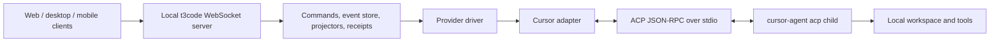
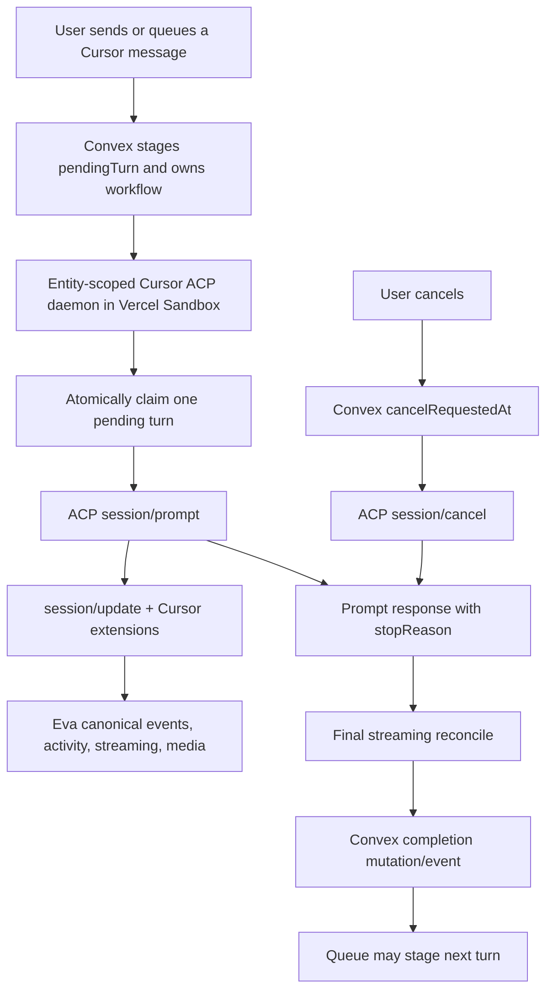

# Plan: Adopt Cursor ACP without adopting t3code's orchestration stack

Status: recommended, not implemented

Research date: 2026-07-31
t3code revision reviewed: [`fccec9f097ab6b89714161ccab2efc7e19d59c00`](https://github.com/pingdotgg/t3code/tree/fccec9f097ab6b89714161ccab2efc7e19d59c00)

## Executive decision

Eva should migrate Cursor from the current one-shot `cursor-agent -p --output-format stream-json` integration to Cursor's stable ACP v1 interface.

Eva should **not** copy t3code's complete provider stack. In particular, Eva should not adopt t3code's Effect runtime, private `effect-acp` package, local WebSocket server, SQLite event store, provider registry, receipt workers, or desktop-login assumptions. Those solve t3code's local multi-client product constraints, not Eva's hosted Convex + Vercel Sandbox constraints.

The migration should have two independently releasable runtime stages:

1. Replace stdout/result inference with an ACP client while keeping Eva's current one-process-per-turn dispatch. This delivers the main correctness benefit with the smallest orchestration change.
2. Reuse Eva's durable `pendingTurn`/`claimPendingTurn` control plane to keep one `cursor-agent acp` child warm per chat entity. This improves follow-up latency and gives queued messages and cancellation the same explicit turn lifecycle as the Claude daemon.

The official [`@agentclientprotocol/sdk`](https://github.com/agentclientprotocol/typescript-sdk) should be used instead of copying t3code's private `effect-acp` implementation. The current stable package is v1.3.0, exposes ACP v1 from its default entry point, is Apache-2.0 licensed, and requires Zod `^3.25.0 || ^4.0.0`. Eva currently targets Node 20 for its callback bundle and uses Zod 3.24, so Node 20 bundling and the Zod upgrade are explicit compatibility gates.

## The premise, corrected

t3code does use the Cursor CLI. It does not use Cursor's cloud SDK or a ChatGPT app server for Cursor.

Its Cursor command is effectively:

```text
cursor-agent acp
```

t3code spawns that executable as a long-lived child process and speaks newline-delimited JSON-RPC 2.0 over its stdin/stdout. ACP is the structured control protocol; `cursor-agent` remains the local agent runtime.

That distinction matters:

- Eva's current contract is Cursor's presentation-oriented `stream-json` output plus process exit.
- t3code's contract is a bidirectional protocol with requests, notifications, capabilities, typed session state, a terminal prompt response, and cancellation.
- ACP removes completion guesswork. It does not remove the Cursor executable or the need to own a subprocess.

Cursor's current official ACP documentation confirms:

- startup through `agent acp`;
- stdio, JSON-RPC 2.0, and newline-delimited JSON framing;
- `initialize`, `authenticate`, `session/new` or `session/load`, and `session/prompt`;
- `session/update` notifications during a turn;
- `session/request_permission` and `session/cancel`;
- pre-authentication through `CURSOR_API_KEY`, which matches Eva's hosted credential model;
- `agent`, `plan`, and `ask` modes;
- blocking `cursor/ask_question` and `cursor/create_plan` extensions;
- notification extensions for todos, subagent task completion, and generated images.

Primary reference: [Cursor ACP documentation](https://cursor.com/docs/cli/acp.md).

## Research scope

The t3code review covered the current source, supporting tests, provider documentation, package boundaries, and the history of its Cursor ACP migration.

### t3code sources reviewed

- [`AGENTS.md`](https://github.com/pingdotgg/t3code/blob/fccec9f097ab6b89714161ccab2efc7e19d59c00/AGENTS.md)
- [`README.md`](https://github.com/pingdotgg/t3code/blob/fccec9f097ab6b89714161ccab2efc7e19d59c00/README.md)
- [`docs/internals/overview.md`](https://github.com/pingdotgg/t3code/blob/fccec9f097ab6b89714161ccab2efc7e19d59c00/docs/internals/overview.md)
- [`docs/internals/providers.md`](https://github.com/pingdotgg/t3code/blob/fccec9f097ab6b89714161ccab2efc7e19d59c00/docs/internals/providers.md)
- [`CursorDriver.ts`](https://github.com/pingdotgg/t3code/blob/fccec9f097ab6b89714161ccab2efc7e19d59c00/apps/server/src/provider/Drivers/CursorDriver.ts)
- [`CursorProvider.ts`](https://github.com/pingdotgg/t3code/blob/fccec9f097ab6b89714161ccab2efc7e19d59c00/apps/server/src/provider/Layers/CursorProvider.ts)
- [`CursorAdapter.ts`](https://github.com/pingdotgg/t3code/blob/fccec9f097ab6b89714161ccab2efc7e19d59c00/apps/server/src/provider/Layers/CursorAdapter.ts)
- [`AcpSessionRuntime.ts`](https://github.com/pingdotgg/t3code/blob/fccec9f097ab6b89714161ccab2efc7e19d59c00/apps/server/src/provider/acp/AcpSessionRuntime.ts)
- [`CursorAcpSupport.ts`](https://github.com/pingdotgg/t3code/blob/fccec9f097ab6b89714161ccab2efc7e19d59c00/apps/server/src/provider/acp/CursorAcpSupport.ts)
- [`CursorAcpExtension.ts`](https://github.com/pingdotgg/t3code/blob/fccec9f097ab6b89714161ccab2efc7e19d59c00/apps/server/src/provider/acp/CursorAcpExtension.ts)
- [`packages/effect-acp`](https://github.com/pingdotgg/t3code/tree/fccec9f097ab6b89714161ccab2efc7e19d59c00/packages/effect-acp)
- Cursor ACP runtime, JSON-RPC, model, adapter, resume, replay, permission, and probe tests.
- Cursor provider history from the original stream-JSON design through the ACP merge and later model/replay hardening.

### Official protocol sources reviewed

- [ACP v1 overview](https://agentclientprotocol.com/protocol/v1/overview)
- [ACP v1 session setup](https://agentclientprotocol.com/protocol/v1/session-setup)
- [ACP v1 prompt turns](https://agentclientprotocol.com/protocol/v1/prompt-turn)
- [ACP v1 cancellation](https://agentclientprotocol.com/protocol/v1/cancellation)
- [ACP v1 session config options](https://agentclientprotocol.com/protocol/v1/session-config-options)
- [ACP TypeScript SDK](https://github.com/agentclientprotocol/typescript-sdk)
- [Cursor ACP documentation](https://cursor.com/docs/cli/acp.md)

## What t3code actually implements

### Overall runtime

t3code is a local agent-harness control surface:



The server owns provider processes. Clients never talk to Cursor directly. A provider adapter translates Cursor-native events into t3code's canonical orchestration events. t3code then persists those events and projects them into UI state.

This is coherent for a local app serving multiple remote clients. Eva already has a different durable owner: Convex workflows, tables, mutations, and sandbox callbacks. Replacing that with t3code's local event store would create two orchestration systems and weaken recovery.

### Cursor process and session lifecycle

For each active t3code thread, `CursorAdapter` owns a `CursorSessionContext` containing:

- one ACP runtime and child-process scope;
- the Cursor session ID used as its resume cursor;
- the current model/mode/configuration;
- pending permission and user-input requests;
- a local turn/item log;
- the active prompt and prompt count.

Session startup:

1. Build spawn input for `cursor-agent acp`.
2. Start the child with piped stdin/stdout/stderr.
3. Initialize ACP v1 and advertise client capabilities.
4. Authenticate using `cursor_login`.
5. Register Cursor extension handlers.
6. Call `session/load` when a resume session ID exists; otherwise call `session/new`.
7. Pass the workspace and MCP servers with the session request.
8. Apply model, reasoning, context, fast-mode, and operating-mode configuration.
9. Start consuming session updates and translating them into provider events.

The adapter retains only the Cursor session ID as its durable provider cursor. The long-lived process is an optimization and a live-session owner, not the only source of conversation persistence.

### Prompt completion

t3code sends a structured ACP prompt and awaits the `session/prompt` RPC response. The response contains a protocol `stopReason`.

This is the most important difference from Eva's current integration. t3code does not decide that a turn succeeded because:

- some assistant text appeared;
- the process returned exit code zero;
- a last-looking JSON event happened to be parseable.

It receives an explicit response to the exact prompt request. Streaming updates are presentation and activity data; the prompt response is the completion authority.

### Streaming and tool calls

The shared ACP runtime consumes `session/update` notifications and maintains:

- agent message segments;
- thought/reasoning segments;
- tool calls keyed by stable `toolCallId`;
- tool status transitions;
- plans and todo state;
- session configuration changes;
- usage state where advertised.

`CursorAdapter` maps these into t3code's canonical provider events. It preserves message boundaries and tool IDs rather than concatenating all output into one undifferentiated buffer.

### Resume and replay

ACP `session/load` replays the prior conversation as `session/update` notifications before it responds. A client that treats replay as current-turn output will render old answers as the new answer.

t3code explicitly tracks a replay phase and filters replayed updates. It also added a short replay-idle gate because real Cursor/Grok implementations historically emitted some replay around the nominal response boundary.

The official protocol is stricter: the agent must replay the full conversation before returning from `session/load`. Eva should implement the response boundary first and add a quiet-period workaround only if a live Cursor compatibility probe proves that the current CLI violates it. A timing heuristic must not be the primary correctness boundary.

If the initialized agent advertises `sessionCapabilities.resume`, ACP `session/resume` should be preferred because it reconnects without replay. Cursor's public docs currently promise `session/load`, so Eva must not assume resume support.

### Cancellation

t3code sends `session/cancel`, settles pending permission/input requests, and interrupts its local prompt fiber. It waits for the prompt to terminate as `cancelled`.

The ACP specification requires the agent to return a `cancelled` stop reason for the original prompt. This gives Eva a deterministic cancellation acknowledgment. Process termination remains a bounded fallback for an unresponsive child, not the normal cancel mechanism.

### Permissions and Cursor extensions

t3code handles:

- standard `session/request_permission`;
- `cursor/ask_question`;
- `cursor/create_plan`;
- `cursor/update_todos`;
- `cursor/task`;
- model discovery through `cursor/list_available_models`.

Its full-access mode selects `allow_always` when offered and otherwise selects `allow_once`. Interactive modes turn requests into UI events and wait on a deferred user response.

The `cursor/task` notification is especially relevant to Eva: Cursor formally reports subagent task completion with a description, subagent type, optional model, agent ID, and duration. Eva can therefore make Cursor subagent use visible instead of leaving the user to infer it from an unexplained delay or answer.

### Model discovery

t3code discovers models from the authenticated Cursor runtime instead of relying only on a static list. It also reads session configuration options and treats model/reasoning/context/fast settings as advertised capabilities.

This is more reliable than hardcoding every option, but model discovery depends on the specific account and CLI version. Eva should first validate the selected static model against the live session. Dynamic model-list synchronization should be a later, separately observable phase.

### Why t3code has a private ACP package

t3code's `effect-acp` is a private workspace package generated from an ACP schema release and integrated deeply with Effect RPC, scopes, fibers, queues, semaphores, and typed errors. It exists because the rest of t3code is Effect-based.

Eva is not Effect-based. Copying this package would import a second concurrency/error/lifecycle model into the callback bundle and create a private protocol fork to maintain. The official TypeScript SDK now provides the appropriate public boundary.

### Tests and historical hardening

t3code's tests demonstrate the areas a production ACP client must cover:

- exact spawn arguments and endpoint propagation;
- initialization and authentication;
- model and config-option ordering;
- new versus loaded sessions;
- replay filtering;
- content, thought, tool, plan, and todo mapping;
- permission request parsing and settlement;
- cancellation;
- resume cursors;
- stale pending-request cleanup;
- event ordering and deterministic drain;
- live CLI probes for model/config mismatches.

Its history is also instructive. The original Cursor proposal used stream JSON, then was revised to ACP. The implementation subsequently needed model-list, config-option, replay, stale-approval, and provider-state hardening. The conclusion is not merely "use JSON-RPC"; it is "treat the provider boundary as a stateful protocol and test every lifecycle transition."

## Other t3code providers, for later work

Cursor was the requested priority. The adjacent review found:

- Claude uses `@anthropic-ai/claude-agent-sdk`, matching Eva's current strategic direction.
- Codex uses a local Codex app-server integration through t3code's private `effect-codex-app-server`.
- OpenCode uses `@opencode-ai/sdk/v2` and an OpenCode server/client event stream.
- There is no separate ChatGPT provider. In this architecture, the Codex app server is the OpenAI subscription-backed agent runtime.

These findings support provider-specific structured adapters. They do not justify a cross-provider rewrite during the Cursor migration.

## Eva's current Cursor architecture

### Current execution path

For a Cursor turn, Eva currently:

1. Builds a shell command in `callback-src/config.ts`.
2. Places the whole system prompt and user prompt in the `-p` argument.
3. Spawns `cursor-agent` for one turn through `runCliAttempt`.
4. Requests `--output-format stream-json`.
5. Parses stdout lines in `providers/cursor.ts`.
6. captures a `session_id` from the init event and persists it to a small JSON state file;
7. invokes later turns with `--resume`;
8. infers the final reply from a `result` event or, if absent, accumulated assistant text;
9. combines that inference with exit code, timeouts, and signal state to decide success.

The current command also enables `--force`, `--trust`, and `--approve-mcps`, uses `CURSOR_API_KEY`, points Cursor at the Vercel workspace, and translates Eva's MCP configuration into `.cursor/mcp.json`.

### Current queue and daemon split

Eva already has a durable turn-control design:

- Sessions, project chats, and task chats persist `pendingTurn`.
- `claimPendingTurn` atomically hands a staged turn to a sandbox daemon.
- cancellation is persisted as `cancelRequestedAt`;
- workflows await a typed completion event;
- queue dequeue begins only after the current turn settles;
- streaming state is reconciled before completion so a late heartbeat cannot overwrite a later turn.

At present, only Claude uses that daemon-pull route. Cursor, Codex, and OpenCode use one-shot launches. This means the Cursor process is not available to receive a protocol cancel or the next queued prompt.

### Current correctness risk

The current implementation has already exhibited the structural failure mode:

- Cursor streams an early assistant sentence.
- The process dies or is killed before a real result event.
- completion extraction falls back to the assistant text.
- extra guards must then distinguish signal termination, shell-translated 137/143 exits, timeouts, and other non-terminal cases.

The recent signal guard fixes the observed incident. It cannot make a presentation stream equivalent to a request/response protocol. Every new exit edge case risks another false success or stale partial response.

ACP removes that entire class of ambiguity by making the exact prompt RPC response authoritative.

## Architecture comparison

| Concern              | Eva now                                           | t3code                                     | Recommended Eva                                                          |
| -------------------- | ------------------------------------------------- | ------------------------------------------ | ------------------------------------------------------------------------ |
| Cursor executable    | one child per turn                                | long-lived `cursor-agent acp`              | ACP child; one-shot first, then warm per chat entity                     |
| Wire contract        | Cursor `stream-json` output                       | ACP v1 JSON-RPC                            | official ACP v1 SDK                                                      |
| Completion authority | result parsing + assistant fallback + exit checks | `session/prompt` response                  | `session/prompt` response only                                           |
| Resume               | `--resume` and state file                         | `session/load`, replay gate, resume cursor | capability-gated `resume`, else replay-filtered `load`                   |
| Cancel               | kill callback/CLI process                         | `session/cancel`, then scoped disposal     | `session/cancel`, bounded process-kill fallback                          |
| Queue ownership      | Convex workflows/tables                           | local command/event/receipt store          | keep Convex                                                              |
| Runtime state        | sandbox files + Convex                            | in-memory adapter + SQLite event store     | sandbox ACP context + durable Convex control state                       |
| Permissions          | force/trust/approve                               | standard ACP requests + UI                 | deterministic auto-allow initially; existing question UI for elicitation |
| MCP                  | generated `.cursor/mcp.json`                      | session MCP descriptors                    | direct ACP MCP when proven; file fallback during rollout                 |
| Subagent visibility  | inferred from stream tools, incomplete            | Cursor extension events                    | map `cursor/task` and standard tool calls                                |
| Model discovery      | static Eva list                                   | authenticated runtime discovery            | validate first; cache/discover later                                     |
| Framework            | plain TypeScript                                  | Effect                                     | keep plain TypeScript                                                    |

## Target architecture



Convex remains the durable coordinator. The sandbox daemon owns only the live ACP connection and provider session. If the daemon dies, the workflow and pending-turn recovery remain outside it.

## Non-negotiable behavioral invariants

Implementation must preserve these invariants:

1. A turn is successful only after the corresponding `session/prompt` request returns `end_turn`.
2. Assistant text, tool completion, process exit zero, or an idle period can never independently make a turn successful.
3. `session/load` replay can never enter the current turn's streamed text, activity log, final reply, media list, or completion result.
4. Events are scoped by both active Cursor session ID and active Eva turn generation.
5. Only one prompt is in flight for one Cursor session.
6. A cancellation sends `session/cancel`, cancels pending permission/extension requests, and waits for terminal settlement before the next queued turn starts.
7. A child crash, EOF, invalid JSON-RPC stream, signal, timeout, or non-`end_turn` stop reason cannot be converted into success by partial text.
8. The final streaming write happens before the completion mutation. No turn-owned writer can update streaming state after completion.
9. A prompt is never automatically replayed through another transport after Cursor may have accepted it.
10. Auth tokens and MCP authorization headers never enter argv, activity logs, raw protocol logs, or user-facing error details.
11. ACP-created session IDs are not assumed compatible with legacy `--resume` IDs until a live compatibility test proves it.
12. Existing legacy conversations do not silently change transport mid-conversation.
13. Subagent activity is visible when Cursor reports it; unobserved background work may not outlive a completed Eva turn.
14. Job-run commit gates, proof capture, media upload, branch publishing, watchdogs, and completion mutations keep their existing product semantics.

## Detailed implementation plan

### Phase 0: compatibility probe and recorded decision

Build a small, non-production probe under `packages/backend/scripts/` before touching the main callback path.

The probe must use the same:

- `cursor-agent` binary installed by Eva's sandbox setup;
- Node 20 runtime and esbuild target as the callback bundle;
- `CURSOR_API_KEY` authentication;
- Vercel Sandbox image;
- workspace directory;
- MCP URL and authorization-header shape;
- model IDs used by Eva.

Probe sequence:

1. Spawn the existing Cursor binary directly with argument `acp`; do not use a shell.
2. Connect with the stable default export of a pinned `@agentclientprotocol/sdk`.
3. Send `initialize` with ACP v1 and only capabilities Eva actually implements.
4. Record advertised agent/session capabilities and config options.
5. Authenticate with `cursor_login` while `CURSOR_API_KEY` is present in the environment.
6. Create a new session with `cwd` and Eva's HTTP MCP server.
7. Apply each Eva mode mapping:
   - `edit`, `execute`, and `design` -> Cursor `agent`;
   - `plan` -> Cursor `plan`;
   - `ask` -> Cursor `ask`.
8. Select every currently exposed Eva Cursor model by advertised model config, including the `cursor-grok-4.5-*` normalized slugs.
9. Send a prompt that produces text only.
10. Send a prompt that reads a file.
11. Send a prompt that edits a file and runs a command.
12. Invoke one Eva MCP tool and verify HTTP MCP plus headers.
13. Trigger a permission request and confirm the offered option IDs.
14. Trigger `cursor/ask_question` and answer it.
15. Trigger plan/todo extensions.
16. Trigger a Cursor subagent and capture standard tool events plus `cursor/task`.
17. Cancel a slow turn and verify the original prompt settles as `cancelled`.
18. Kill the child during a prompt and verify the client reports failure, not the last text chunk.
19. Close the client, start a second child, and load the session.
20. Verify every replay update occurs before the load response. If not, measure and document the actual current behavior before introducing a bounded replay-idle gate.
21. Check whether `session/resume` is advertised and behaves without replay.
22. Stop/resume the Vercel sandbox and repeat the session-load test.
23. Try loading a legacy session ID produced by `cursor-agent -p --output-format stream-json`.
24. Capture `agent about --format json` or the supported version command and tie the capability record to that exact CLI version/channel.

The probe output must redact prompts, API keys, bearer headers, and repository contents. Persist only:

- Cursor CLI version/channel;
- ACP protocol version;
- advertised capability names;
- config-option IDs and allowed value IDs;
- stop reasons;
- event type/order;
- replay boundary observations;
- timings;
- pass/fail for each scenario.

Go criteria:

- Node 20 bundle runs without runtime polyfills.
- API-key auth succeeds.
- `session/prompt` reliably returns a stop reason.
- session load preserves context without leaking replay into the live turn.
- real cancel settles.
- MCP works.
- selected models and modes work through advertised configuration.

No-go criteria:

- the official SDK cannot be bundled for Node 20 without a large runtime change;
- Cursor cannot authenticate with Eva's API key in ACP mode;
- session loading loses context;
- the prompt response is not a reliable terminal boundary;
- MCP or cancellation is unusable.

If a no-go criterion is hit, stop. Keep the current parser and document the exact vendor gap. Do not copy t3code's Effect stack as an automatic fallback.

### Phase 1: introduce an ACP provider boundary in the callback

Dependencies:

- Add an exact, reviewed version of `@agentclientprotocol/sdk`; the currently researched candidate is `1.3.0`.
- Upgrade backend Zod from 3.24 to at least 3.25 to satisfy the SDK peer dependency; remain on Zod 3 unless a separate migration justifies Zod 4.
- Bundle the SDK into the self-contained callback script. Do not install packages during an agent turn.
- Keep the generated callback target at Node 20 if Phase 0 passes.

Add these plain-TypeScript modules:

- `callback-src/providers/cursorAcpRuntime.ts`
  - direct child spawn;
  - official SDK connection;
  - initialize/authenticate;
  - new/load/resume;
  - config and mode changes;
  - prompt serialization;
  - cancellation;
  - child shutdown and bounded stderr;
  - protocol event serialization.
- `callback-src/providers/cursorAcpEvents.ts`
  - runtime-validated ACP/Cursor-extension payload boundaries;
  - ACP update -> Eva canonical event mapping;
  - current-turn message assembly keyed by `messageId`;
  - tool-call tracking keyed by `toolCallId`;
  - replay and session filtering.
- `callback-src/providers/cursorAcpInteractions.ts`
  - standard permission responses;
  - blocking question round-trip through existing `pendingQuestions`;
  - plan extension policy;
  - todo, subagent, and generated-image notifications.

Do not create a generic all-provider framework. The public surface should be small and Cursor-specific:

```text
start/load session
configure turn
prompt
cancel
close
events
```

Keep `providers/cursor.ts` as the legacy stream-JSON adapter until legacy sessions drain.

#### Runtime state machine

Represent lifecycle explicitly:

```text
not_started
  -> starting
  -> ready(sessionId, replayComplete)
  -> prompting(turnGeneration)
  -> ready
  -> closing
  -> closed
```

Startup failure returns to `not_started` only when it is safe to retry before a prompt was accepted. Concurrent startup callers share one startup promise. Prompt calls are serialized. A prompt generation increments monotonically and all callbacks capture that generation; a callback from a prior generation is ignored.

No type escape hatches are allowed. Open JSON payloads must cross Zod or ACP SDK schemas into a discriminated union. Do not add `any`, `unknown`, type assertions, or non-null assertions.

#### Child ownership

Spawn the existing resolved Cursor binary directly:

```text
cursor-agent acp
```

Set:

- `cwd` to `WORK_DIR`;
- `HOME` to `CURSOR_RUNTIME_HOME_DIR`;
- the existing environment including `CURSOR_API_KEY`;
- stdin/stdout as pipes;
- stderr as a bounded diagnostic stream.

Do not place prompts, system instructions, tokens, or MCP headers in argv. This also prevents cleanup commands from matching the agent's own prompt text, which caused the recording incident.

Capture the exact child PID at spawn. Normal close targets only that PID/process tree. Process-pattern kills remain emergency compatibility cleanup for legacy sessions and should be deleted after drain.

#### Initialization and capability negotiation

Initialize ACP v1. Advertise only implemented client capabilities:

- no client-owned filesystem methods while Cursor operates directly in the sandbox workspace;
- no client-owned terminal methods unless a later need is proven;
- image prompt capability only after the callback supports the SDK's content type end to end;
- Cursor extension capability metadata required by the current CLI, verified in Phase 0.

Persist a sanitized capability snapshot in the raw diagnostic log.

Authenticate with `cursor_login`. The API key remains in the environment; do not pass `--api-key` in argv.

If the installed CLI lacks required capabilities, fail preflight with a precise message containing the CLI version and missing capability. Do not tell the user that their coding request failed.

#### Session creation, loading, and replay

Replace the Cursor state file with a versioned provider state:

```json
{
  "schemaVersion": 2,
  "transport": "acp-v1",
  "sessionId": "opaque-cursor-session-id"
}
```

Interpret the current `{ "resumeSessionId": "..." }` shape as legacy stream-JSON state.

For ACP state:

1. Prefer `session/resume` only when the initialized agent advertises it.
2. Otherwise call `session/load`.
3. Set `phase = replaying` before the request.
4. Validate session IDs on every notification.
5. Consume replay into no Eva turn state.
6. Mark replay complete only after the load response.
7. If the Phase 0 probe proves late replay, add one documented, bounded quiet gate scoped only to load. Reset it on every replay update. Never use it for prompt completion.
8. Apply current model and mode only after load/new has returned.

For a new ACP session, call `session/new`, persist the returned ID atomically to the runtime and persistence state files, then configure the session.

Keep `.cursor/mcp.json` during the first canary as a compatibility fallback. Also pass Eva's MCP server in the ACP session request when Cursor advertises HTTP MCP support. Once direct ACP MCP has passed all rollout gates, remove the generated file path so MCP configuration has one owner.

#### Prompt construction

ACP does not provide an Eva-specific system-prompt field. Preserve current behavior by sending the existing combined system instructions and turn prompt as one ACP text content block.

For attachments:

- first release: preserve the current sandbox materialization and append the existing absolute-path note;
- later: add ACP image content blocks only after capability negotiation and typed media tests pass.

Never send the prompt until:

- replay is complete;
- the requested model is selected;
- the requested operating mode is selected;
- blocking interaction handlers are installed;
- MCP setup has either succeeded or returned a clear preflight error.

#### Mode and model configuration

Use advertised session config options rather than assuming option IDs.

Map Eva modes:

| Eva mode  | Cursor mode |
| --------- | ----------- |
| `edit`    | `agent`     |
| `execute` | `agent`     |
| `design`  | `agent`     |
| `plan`    | `plan`      |
| `ask`     | `ask`       |

Resolve the model from the advertised model-category option. Match the fully normalized Cursor model ID. If no exact match exists, fail before `session/prompt` and list the selected model plus available IDs in sanitized diagnostics.

Apply changed model/mode options before each prompt so a warm daemon can support composer changes without losing session context. Configuration failure is preflight failure and may not silently fall back to another model.

Keep Eva's static model picker in the first release. Dynamic discovery is Phase 5.

#### Canonical event mapping

Extend the canonical adapter only where ACP contains information Eva cannot currently express.

Map:

- `agent_message_chunk` -> current-turn response text;
- `agent_thought_chunk` -> reasoning;
- `tool_call` -> active `ProgressStep` keyed by `toolCallId`;
- `tool_call_update` -> update/complete the exact step;
- plan updates -> todo/plan activity;
- usage updates -> typed usage/cost state when Cursor supplies it;
- session config updates -> diagnostic/provider state, not chat text;
- `cursor/update_todos` -> `S.todoState`;
- `cursor/task` -> a visible `subtask` step with type, description, agent ID, model, and duration;
- `cursor/generate_image` -> an image-generation step and a path candidate for existing media harvest.

Text rules:

- accept only agent-message chunks for the active session and turn generation;
- group chunks by `messageId`;
- preserve paragraph boundaries between multiple agent messages;
- never mix thought chunks into the final answer;
- never use user-message chunks as output;
- never concatenate replayed messages;
- prefer the final current-turn agent message sequence as the result.

Tool rules:

- stable `toolCallId` is the only primary correlation key;
- duplicate status notifications are idempotent;
- completed/error/cancelled are terminal;
- a `cursor/task` notification merges with an existing tool/subtask row when IDs match, otherwise creates a completed subtask row;
- all open tools become cancelled on turn cancellation and failed on transport loss.

#### Completion classification

Create a provider-structured attempt result instead of forcing ACP through `CliAttemptResult`.

The ACP result must include:

- transport (`acp-v1`);
- session ID;
- stop reason;
- current-turn final text;
- current-turn canonical events;
- duration and optional usage;
- whether prompt submission occurred;
- cancellation acknowledgment;
- transport/process failure details.

Product classification:

| ACP outcome                                          | Eva outcome                                                         |
| ---------------------------------------------------- | ------------------------------------------------------------------- |
| `end_turn` with final text or delivered media        | success                                                             |
| `end_turn` with no text, media, or meaningful result | failure: completed without an assistant response                    |
| `max_tokens`                                         | failure with preserved partial output and limit explanation         |
| `max_turn_requests`                                  | failure with preserved partial output and request-limit explanation |
| `refusal`                                            | failure with preserved refusal text                                 |
| `cancelled` after user cancel                        | cancelled, not generic failure                                      |
| JSON-RPC error                                       | failure                                                             |
| child EOF/exit/signal before prompt response         | failure                                                             |
| timeout                                              | failure after cancel attempt                                        |
| malformed protocol data that breaks the session      | failure                                                             |

Remove Cursor's assistant-text success fallback from the ACP path. Leave it only in the explicitly legacy parser until drain.

Before returning the result, await the adapter's ordered event-processing chain through the prompt response boundary. Do not sleep to "let the last event arrive." If the SDK invokes asynchronous handlers, serialize them through a promise chain and await its barrier.

#### Permission and extension policy

Initial standard permission policy must preserve current `--force --trust` behavior:

1. Inspect the option IDs Cursor supplied.
2. Choose the semantic `allow-always` option when present.
3. Otherwise choose `allow-once`.
4. If neither is offered, reject with a typed provider error rather than guessing an ID.

For `cursor/ask_question`:

1. Convert Cursor question IDs/options to the existing `pendingQuestions` payload shape.
2. Post it using the current entity ID and Cursor `toolCallId`.
3. Mark `S.awaitingQuestionAnswer` so watchdogs pause.
4. Poll the existing answer mutation with the prompt abort signal.
5. Translate selected labels back to Cursor option IDs.
6. Reply `answered`, `skipped`, or `cancelled`.

For `cursor/create_plan` in the initial release:

- record the plan and todos in the activity stream;
- automatically return `accepted` because Eva currently runs Cursor with full autonomy and has no intermediate plan-approval interaction;
- rely on Cursor `plan` mode plus Eva's plan prompt to remain read-only;
- log this policy explicitly.

A later plan-approval UI may generalize `pendingQuestions` into a discriminated pending-interaction table. Do not add that schema/UI expansion to the transport migration unless product requirements change.

For cancellation:

- return `cancelled` to every pending permission/question/plan request;
- delete or clear the corresponding pending-question row;
- resume the watchdog state in `finally`;
- then wait for the original prompt to settle.

#### Observability

Add structured, redacted log records for:

- transport and provider-state schema version;
- CLI version/channel;
- ACP protocol version;
- session new/load/resume;
- replay start/notification count/end;
- prompt generation and request ID;
- time to child ready, session ready, first update, first text, and prompt completion;
- stop reason;
- permission/extension method names and settlement;
- tool-call counts and terminal states;
- cancel requested/sent/acknowledged;
- child exit code/signal;
- bounded stderr tail.

Never log:

- full prompt or assistant content in protocol diagnostics;
- API keys;
- MCP bearer headers;
- raw environment;
- full file contents;
- unbounded JSON-RPC messages.

Keep the existing raw log only if payload redaction happens before write. Otherwise replace Cursor ACP raw logging with metadata-only records.

### Phase 2: ship one-shot ACP behind durable transport selection

Before introducing a daemon, run the ACP client once per turn through the existing `launchOnExistingSandbox` path.

This stage deliberately keeps:

- current workflows;
- current one-shot callback launch;
- current queue push/dequeue behavior;
- current sandbox/process cleanup;
- current proof/commit/media completion path.

Only the provider protocol changes. The callback starts `cursor-agent acp`, loads/new the session, sends one prompt, receives a terminal response, persists state, and closes.

#### Durable transport marker

Add one optional field through the shared `chatDaemonEntityFields` validator:

```text
cursorTransport: "stream-json" | "acp-v1"
```

Use the same exported validator in table fields and any return validators. Do not duplicate schema unions.

Migration policy:

- backfill every existing session, project, and task chat entity to `stream-json`;
- new entities created after ACP enablement receive `acp-v1`;
- an existing entity may be promoted only through an explicit internal mutation after either:
  - Phase 0 proves legacy IDs load correctly through ACP; or
  - the user/operator elects to start a fresh Cursor conversation and clears legacy Cursor state.

This is conservative but makes rollback and mixed-version sandboxes understandable.

Job/automation runs do not need a chat-entity marker because each run is already an isolated durable unit. Gate their ACP path with an explicit rollout setting and never switch transport after prompt submission.

#### Routing flags

Use independent controls:

- default transport assigned to new Cursor chat entities;
- ACP eligibility for non-chat job runs;
- Cursor ACP daemon enabled/disabled.

The stored entity marker wins over the default. Disabling the daemon must route an `acp-v1` entity to one-shot ACP, not back to stream JSON.

Before the prompt is submitted, a brand-new ACP entity may be reverted to legacy after a capability/auth preflight failure if no ACP session ID or workspace mutation exists. After prompt submission, never retry automatically through legacy.

#### One-shot acceptance gate

Exercise all Eva surfaces that can run Cursor:

- session edit;
- session ask;
- session plan;
- session design;
- queued session messages;
- project sandbox chat;
- task sandbox chat;
- quick-task/job execution;
- proof capture;
- audit/automation/arena paths that support Cursor;
- cancellation;
- attachment input;
- MCP tools;
- branch push and commit gate.

Keep this release at internal-only/new-entity canary until completion classification, replay filtering, and cancellation are proven in production-like sandboxes.

### Phase 3: add a warm Cursor ACP daemon for chat entities

After one-shot ACP is stable, add `callback-src/providers/cursorAcpDaemon.ts`.

Do not modify the ACP protocol/runtime to become daemon-specific. The one-shot path and daemon must call the same session runtime:

- one-shot: start -> load/new -> prompt -> close;
- daemon: start -> load/new -> prompt -> ready -> prompt -> ... -> idle close.

The daemon should mirror the reliable control-plane behavior of `claudeSdkDaemon.ts`, but not copy Claude-only synthetic/background-agent machinery.

#### Daemon lifecycle

1. Prewarm starts the callback with no prompt and a claim mutation.
2. The callback initializes/authenticates Cursor and loads/news its session.
3. It writes the existing ready/PID/entity/options markers.
4. A claim watcher polls `claimPendingTurn`.
5. The first claimed turn is configured and sent through `session/prompt`.
6. The daemon emits streaming/activity and heartbeats.
7. It reconciles final streaming state.
8. It sends the completion mutation.
9. It resets every turn-local accumulator.
10. It becomes ready for the next claim.
11. It exits after the existing idle budget or callback fingerprint mismatch.

Keep one active turn plus at most one parked claimed turn during a cancellation race. If a second claim is impossible by Convex invariant, assert and log it. Never discard a claimed prompt after `claimPendingTurn` has cleared it server-side.

#### Convex routing

Add one centralized helper used by sessions, task chat, project chat, prewarm, cancellation, and recovery:

```text
usesDaemonPull(model, cursorTransport, daemonEnabled)
```

It returns true for:

- Claude, preserving current behavior;
- Cursor when the entity is `acp-v1` and the Cursor daemon flag is enabled.

Replace the current scattered `provider === "claude"` conditions with that helper. This includes:

- staging `pendingTurn`;
- scheduling prewarm;
- workflow `ensurePendingTurn`;
- selecting prewarm versus one-shot launch;
- cancellation flag versus process kill;
- stuck-turn recovery;
- comments and operator error messages.

Add optional `mode` to `pendingTurnFields`. Sessions write their exact mode; project/task chats omit it and default to `agent`. Return it from each `claimPendingTurn` mutation. This lets the warm ACP session change modes per turn without respawning.

`runPrewarmEntityDaemon` must:

- accept Claude or eligible Cursor ACP entities;
- preserve entity-scoped PID files;
- include provider/transport in its options signature;
- defer options-mismatch replacement while a turn is active;
- start the same callback bundle with the correct provider state;
- never wake a stopped/archived sandbox merely to prewarm.

#### Cancellation

For an eligible Cursor daemon:

1. Convex sets `cancelRequestedAt`.
2. The daemon's next claim poll drains the flag even without a pending turn.
3. The daemon marks open tools cancelled.
4. It resolves all blocking ACP requests as cancelled.
5. It sends `session/cancel`.
6. It waits a short, bounded period for `stopReason = cancelled`.
7. If Cursor does not settle, it kills only the captured Cursor child PID.
8. If the ACP runtime is no longer trustworthy, the daemon exits so prewarm creates a clean one.
9. Convex finalizes the cancelled assistant placeholder and may start the next queued turn only after cancellation settlement.

Do not kill the whole sandbox, preview dev server, browser daemon, or unrelated provider process.

#### Queue correctness

Add contract coverage for:

- regular follow-up while daemon is idle;
- two queued messages;
- queueing during a tool call;
- cancel followed immediately by a queued message;
- cancel racing with `startExecute`;
- daemon death before claim;
- daemon death after claim but before prompt;
- daemon death after prompt acceptance;
- options/model change with a pending turn;
- final streaming reconcile before completion;
- no old reply appearing in the next placeholder;
- exactly one completion event per prompt.

Recovery rule:

- before prompt acceptance, a safely recoverable claimed turn may be restaged;
- after prompt acceptance, automatic replay is forbidden because file edits may already have occurred;
- the workflow must fail clearly and let the user explicitly retry.

Record a `promptSubmittedAt`/turn-attempt marker in daemon memory and diagnostics so the failure path can distinguish those cases.

#### Session shutdown and persistence

On idle/fingerprint/options shutdown:

- do not close while a prompt or blocking interaction is active;
- call `session/close` only if advertised and only when intentionally releasing the live session;
- otherwise close the transport/child while preserving the durable Cursor session;
- atomically sync the ACP state file to `/home/eva/.cursor-persist`;
- clear only this entity's daemon marker files;
- leave Convex workflow ownership untouched.

On sandbox stop, clear pending interactions just as the current Claude path does.

### Phase 4: make Cursor's richer behavior visible

This phase should land with or immediately after the daemon canary so users can understand what Cursor is doing.

#### Subagents

Use standard tool calls and `cursor/task` together:

- show a `subtask` activity row when a matching tool call starts;
- enrich/complete it when `cursor/task` arrives;
- show `subagentType`, concise description, model when present, duration, and status;
- retain `agentId` only as provider metadata, not user-facing prose;
- do not expose a stop-subagent control because Cursor ACP documents whole-turn cancellation, not an individual task-cancel method.

If the compatibility probe shows Cursor can leave subagents running after `session/prompt` completes, do not ship daemon mode until there is a supported settlement/cancel contract. A completed Eva turn may not hide live provider work.

#### Plans and todos

- Merge `cursor/update_todos` by ID when `merge = true`; replace when false.
- Convert Cursor's `cancelled` todo status to a completed/error presentation without weakening Eva's existing `TodoItem` type, or deliberately extend the type/UI in one small typed change.
- Surface `cursor/create_plan` as a plan activity block.
- Continue to save the final plan through Eva's existing plan-mode result handling.

#### Generated images and recordings

- Treat `cursor/generate_image.filePath` as an untrusted path.
- Resolve and verify it remains within approved workspace/media directories.
- Feed valid paths into existing media harvest.
- Do not accept inline image data until size limits and decoding are explicitly implemented.
- Preserve the proof-capture contract: a turn claiming recordings/walkthroughs is successful only when the expected media files exist and are uploaded before completion.

### Phase 5: dynamic Cursor capabilities and models

Do this only after the transport and daemon are stable.

At ACP startup:

- call the current Cursor model-list extension when available;
- read parameterized model/config options;
- normalize them into Eva's model metadata;
- attach provider account ID, CLI version, and fetched-at time;
- send a sanitized capability result to Convex.

Cache per provider account + CLI version with a bounded TTL. Never share a personal account's model entitlements with another account.

UI behavior:

- static catalog remains the bootstrap/fallback;
- dynamically unavailable models are disabled with an explanation;
- newly advertised models may be shown only after mapping display name, provider prefix, and supported traits;
- selected model is revalidated inside the sandbox immediately before the prompt.

Reasoning/context/fast options must be applied only when advertised. Unsupported user-selected traits produce a clear downgrade/error policy; they may not be silently converted to arbitrary values.

Do not copy t3code's old lab-channel/minimum-date requirement. Derive Eva's minimum supported Cursor CLI version from the actual Phase 0 and canary capability matrix.

### Phase 6: rollout, rollback, and legacy cleanup

Rollout sequence:

1. Merge dependencies, probe, types, and tests with production behavior unchanged.
2. Enable one-shot ACP for internal/new test entities only.
3. Complete at least 30 scenario-complete turns across models/modes/surfaces.
4. Enable new-entity one-shot ACP at 10% for 48 hours.
5. Advance to 50% for 48 hours.
6. Advance new entities to 100% for seven days.
7. Enable the Cursor daemon for internal ACP entities.
8. Repeat 10% -> 50% -> 100% daemon rollout with the same hold periods.
9. Enable ACP for isolated job/automation runs after chat stability.
10. Offer explicit promotion/reset for old legacy entities.
11. Remove legacy only after no active entity has `cursorTransport = "stream-json"` and rollback retention has elapsed.

Promotion gates:

- no stale/replayed reply incidents;
- no false success after child death/signal;
- no duplicate prompt submissions;
- no lost queued messages;
- no completion before subagent/tool settlement;
- cancellation acknowledged or bounded fallback succeeds;
- no regression in proof/media/commit gates;
- session context survives child restart and sandbox stop/resume;
- MCP success rate matches legacy;
- p95 first-text and completion latency no worse than the agreed baseline for one-shot, and materially better for warm follow-ups;
- no auth/header leakage in logs.

Rollback:

- daemon issue: disable daemon and keep `acp-v1` entities on one-shot ACP;
- ACP preflight issue on a brand-new, unused entity: mark it legacy before prompt submission;
- ACP issue after an entity has an ACP session: fail clearly or roll forward a protocol fix; do not silently route its next prompt through `-p`;
- never replay a possibly accepted prompt during fallback;
- keep legacy parser and command builder until the retention window ends.

Legacy cleanup removes:

- Cursor `-p --output-format stream-json` command construction;
- `--resume` routing;
- Cursor stream-JSON parser and result fallback;
- legacy signal-specific success guards that exist only for Cursor parsing;
- `.cursor/mcp.json` generation if direct ACP MCP is proven;
- broad Cursor process-pattern cleanup;
- legacy state-file parsing;
- the `stream-json` transport value and rollout flags.

Cleanup is a separate change after stable production evidence, not part of initial adoption.

## File-by-file implementation map

| File or area                                         | Planned change                                                                 |
| ---------------------------------------------------- | ------------------------------------------------------------------------------ |
| `packages/backend/package.json`                      | Add exact ACP SDK; move Zod to compatible 3.25+                                |
| workspace lockfile                                   | Record reviewed dependency graph                                               |
| `packages/backend/scripts/build-callback-script.mjs` | Keep Node 20; prove SDK bundles; fail closed                                   |
| `packages/backend/scripts/cursor-acp-probe.*`        | Add live, redacted compatibility probe                                         |
| `callback-src/config.ts`                             | Resolve ACP binary/env/flags; remove shell prompt argv from ACP path           |
| `callback-src/types.ts`                              | Add structured provider attempt/ACP stop result without weakening legacy types |
| `callback-src/runtime/state.ts`                      | Add explicit ACP session/turn state or keep it inside runtime instance         |
| `callback-src/providers/cursor.ts`                   | Remain legacy-only until drain                                                 |
| `callback-src/providers/cursorAcpRuntime.ts`         | New official-SDK child/session state machine                                   |
| `callback-src/providers/cursorAcpEvents.ts`          | New ACP/Cursor event adapter and current-turn assembler                        |
| `callback-src/providers/cursorAcpInteractions.ts`    | New permission/question/plan/todo/task/image handlers                          |
| `callback-src/providers/cursorAcpDaemon.ts`          | New warm claim-loop wrapper in Phase 3                                         |
| `callback-src/providers/attempts.ts`                 | Route legacy vs one-shot ACP                                                   |
| `callback-src/session/cursorSession.ts`              | Versioned transport/session state and atomic persistence                       |
| `callback-src/runtime/completion.ts`                 | Accept structured ACP result; no assistant fallback on ACP                     |
| `callback-src/index.ts`                              | Enter Cursor daemon when eligible; preserve finalization order                 |
| `callback-src/runtime/pendingQuestion.ts`            | Share typed question post/poll primitives with Cursor                          |
| `convex/_validators/tableFields.ts`                  | Export transport validator; add entity marker and optional pending-turn mode   |
| `convex/schema.ts`                                   | Consume shared fields; no duplicated validators                                |
| `convex/_chat/daemonProvider.ts`                     | New single daemon-eligibility policy                                           |
| `convex/_sessions/execution.ts`                      | Stage/prewarm/cancel Cursor ACP daemon turns                                   |
| `convex/_sessions/workflow.ts`                       | Ensure/claim versus one-shot based on shared policy                            |
| `convex/agentTaskChatWorkflow.ts`                    | Same shared policy for task chat                                               |
| `convex/projectChatWorkflow.ts`                      | Same shared policy for project chat                                            |
| `convex/_chat/*Daemon.ts`                            | Return pending-turn mode and preserve cancellation/recovery invariants         |
| `convex/_sandbox_runtime/execution.ts`               | Prewarm Claude or Cursor ACP; provider-aware options signature                 |
| `convex/_sandbox_runtime/launch.ts`                  | Pass transport/config and direct MCP inputs safely                             |
| `convex/_sandbox_runtime/helpers.ts`                 | Replace broad Cursor kills after legacy drain                                  |
| `convex/pendingQuestions.ts`                         | Reuse existing interaction transport; clear on Cursor cancel/stop              |
| chat UI activity components                          | Render enriched Cursor subtask/plan/todo data if canonical fields expand       |
| `internal/changelog.md`                              | Record each shipped phase and why                                              |

Generated Convex API and callback bundle files must be regenerated through the normal codegen/build commands during implementation; do not hand-edit them.

## Test plan

### Pure/unit tests

- transport state migration: old state -> legacy, new ACP state round-trip;
- capability parsing;
- model/mode option matching;
- session/new versus load versus resume choice;
- replay filtering;
- session ID and turn-generation filtering;
- message chunk ordering and `messageId` boundaries;
- thought exclusion from final result;
- tool lifecycle correlation and idempotency;
- todo merge/replace;
- Cursor task merge into subtask step;
- generated-image path validation;
- permission option selection;
- ask-question payload/answer ID translation;
- plan auto-accept policy;
- stop-reason classification;
- no-text `end_turn`;
- JSON-RPC error/EOF/signal after partial text;
- cancellation settlement;
- event barrier before completion;
- redaction and log byte limits.

### Mocked protocol contract tests

- initialize -> authenticate -> new -> configure -> prompt;
- load emits replay then response then prompt;
- deliberately late replay fixture verifies the compatibility gate;
- prompt streams text/tool/text then returns `end_turn`;
- permission request blocks and receives allow;
- question request blocks and receives a structured answer;
- cancel settles permission/question and prompt;
- child exits before response;
- malformed NDJSON;
- duplicate/out-of-order tool updates;
- config update fails before prompt;
- MCP capability absent;
- session ID mismatch;
- stale event from prior turn generation;
- two prompt calls serialize.

### Convex workflow/queue contract tests

- daemon eligibility is identical across session/project/task chat;
- new entities receive ACP marker; existing backfill stays legacy;
- one-shot ACP does not stage `pendingTurn`;
- daemon ACP stages exactly one `pendingTurn`;
- claim returns mode/model/attachments exactly once;
- cancel flag drains mid-turn and while idle;
- pending-turn cancel race restages safely only before prompt acceptance;
- queued turn starts after completion/cancellation, never before;
- streaming row is clear for the next placeholder;
- old reply cannot be resurrected by a late heartbeat;
- completion event is exactly once;
- options mismatch cannot kill an active daemon;
- stopped sandbox is not resurrected by prewarm.

### Real Vercel Sandbox scenarios

Run against the same image and credential path as production:

- first message and ten follow-ups;
- child restart and session load;
- sandbox stop/resume;
- all Eva modes;
- every exposed Cursor model;
- personal and team API-key accounts;
- MCP read and mutating tools;
- file read/edit/shell;
- attachment input;
- question interaction;
- plan/todo;
- subagent;
- image generation if supported;
- recording/walkthrough proof;
- cancel during thinking, tool, question, and subagent;
- process kill after partial text;
- no-output and max-runtime watchdogs;
- two queued turns;
- cancel plus immediate queue;
- model switch between warm turns;
- branch push failure after saved result;
- commit gate success/failure;
- provider rate/auth/model errors.

### Verification commands during implementation

Repository rules require targeted verification after implementation:

- callback TypeScript check;
- backend Convex TypeScript check;
- focused callback/provider tests;
- focused queue/workflow tests;
- callback bundle generation;
- `npx convex dev` for schema/function validation when the implementation turn authorizes it;
- real probe in a Vercel Sandbox.

Do not run a dev server, lint, or broad build unless separately requested.

## Risks and mitigations

### Official SDK changes

Risk: the official SDK is active and v2 is already a draft.

Mitigation: pin stable v1 exactly, import only the default stable entry point, keep ACP behind a Cursor adapter, and update only through a dedicated compatibility change.

### Node 20 incompatibility

Risk: t3code itself requires newer Node versions even though the ACP SDK package declares no engine.

Mitigation: make Node 20 bundle/runtime proof a Phase 0 gate. Do not move Eva's callback to Node 24 merely because t3code uses it.

### Replay leakage

Risk: loaded history looks exactly like live session updates.

Mitigation: explicit replay state, session/turn generation filters, load-response boundary, real late-replay fixture, and no timing heuristic unless current Cursor behavior proves it necessary.

### Duplicate side effects during recovery

Risk: a prompt may edit files before the transport dies.

Mitigation: persist/observe whether prompt submission occurred and never automatically replay after it. Fail visibly and require an explicit user retry.

### Blocking extensions deadlock

Risk: Cursor waits forever if permission/question/plan requests are unanswered.

Mitigation: install handlers before prompt, deterministic permission policy, reuse existing question round-trip, explicit plan auto-accept, cancel every pending request on teardown, and pause watchdogs only while a genuine user interaction is open.

### Hidden subagent work

Risk: the UI says a turn is done while Cursor still has subagents.

Mitigation: map standard tool and `cursor/task` events, assert no open tool/subtask at successful completion, and block daemon rollout if live probing shows background work can outlive the prompt response.

### Mixed legacy/ACP sessions

Risk: session IDs or persistence layouts differ.

Mitigation: durable transport markers, legacy backfill, ACP for new entities, no silent conversion, and explicit promotion only after compatibility proof.

### MCP duplication

Risk: providing MCP through ACP and `.cursor/mcp.json` connects twice.

Mitigation: inspect the live probe, use one source in steady state, retain the file only as a short canary fallback, and test tool-call duplication.

### Daemon complexity

Risk: a second provider daemon creates drift with Claude.

Mitigation: share only provider-neutral claim/cancel/finalization primitives with proven identical semantics. Keep Cursor protocol/session logic separate. Revisit deeper extraction only after both daemons are stable.

## Explicitly rejected alternatives

### Adopt `@cursor/sdk` local agents

Rejected for this plan. The prior Eva plan assumed Cursor's TypeScript SDK local mode. t3code is not evidence for that design; its production Cursor integration uses ACP. ACP now directly exposes the session, streaming, permissions, cancellation, model configuration, and extensions Eva needs while preserving the existing Cursor CLI/auth/runtime.

### Keep stream JSON and add more guards

Rejected as the long-term design. Signal guards can patch individual incidents, but stdout parsing still lacks a response correlated to the exact prompt and a protocol cancellation acknowledgment.

### Copy t3code's `effect-acp`

Rejected. It is private, generated around a pinned older schema, and deeply coupled to Effect. Eva can obtain the protocol boundary through the official SDK without adopting the framework.

### Adopt t3code's whole provider/event-store architecture

Rejected. Eva already has a durable distributed coordinator in Convex. Replacing it would be a product-wide rewrite with no Cursor-specific correctness benefit.

### Jump directly to a persistent daemon

Rejected as the first release. One-shot ACP isolates protocol correctness from queue/daemon changes and provides a clean rollback boundary. The reusable ACP runtime means the one-shot stage is not throwaway work.

### Automatically fall back after ACP failure

Rejected once `session/prompt` may have been accepted. Automatic fallback can duplicate commands, edits, commits, recordings, and external MCP effects.

## Definition of done

Cursor ACP adoption is complete only when:

- all new eligible Cursor conversations use ACP v1;
- chat surfaces use the warm daemon at full rollout;
- non-chat Cursor runs use structured ACP completion;
- final replies derive only from the exact prompt response/current-turn message set;
- replayed history never appears as a live reply;
- cancellation is protocol-first and queue-safe;
- subagent, plan, todo, and question behavior is visible and cannot deadlock;
- context survives child and sandbox restarts;
- MCP, media, proof, commit, publish, and queue behavior match or improve on legacy;
- production gates have held for seven days;
- active legacy entities have drained or been explicitly migrated/reset;
- legacy parser/command/fallback/process cleanup is removed in a separate cleanup change;
- architecture and operations docs describe ACP as the Cursor integration contract.

## Follow-up provider order

After Cursor is stable:

1. Reassess Codex against t3code's app-server design and Eva's current Codex JSON stream.
2. Reassess OpenCode against its official SDK/server event stream; supersede the old combined migration plan with current versions.
3. Keep Claude on its Agent SDK daemon and compare only shared daemon-control primitives.
4. Treat "ChatGPT" as the Codex app-server/account path unless OpenAI introduces a separate supported agent runtime.

Each provider should receive its own decision record and rollout. Cursor adoption must not wait for a universal provider abstraction.

## Unresolved questions

No product decision blocks implementation. Phase 0 intentionally resolves these vendor/runtime facts before production code is enabled:

- Does the current Eva Cursor CLI advertise `session/resume`, or only `session/load`?
- Does current Cursor honor the ACP load-response replay boundary, or require a bounded compatibility quiet gate?
- Are legacy stream-JSON session IDs loadable through ACP?
- Does direct HTTP MCP work with Eva's authorization headers without also writing `.cursor/mcp.json`?
- Which exact model/mode/config option IDs are advertised for team and personal API-key accounts?
- Can any Cursor subagent outlive the `session/prompt` response?
- Does `@agentclientprotocol/sdk@1.3.0` bundle and run cleanly in Eva's Node 20 callback?

These are go/no-go measurements, not invitations to guess during implementation.

## Final implementation step

After all phases requested for the implementation session are verified, run `/ship` to stage only the session-related files, create the conventional commit, and push the approved branch.
